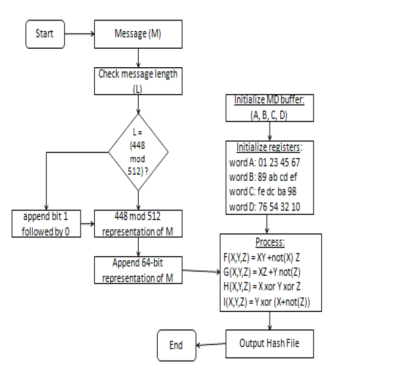
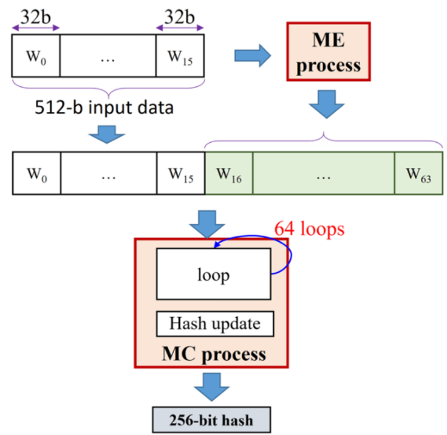

# HEŠOVANJE LOZINKI

Sa razvojem informacionih sistema i aplikacija javlja se potreba sa očuvanjem privatnosti podataka kako samog sistema, tako i subjektima samog sistema. Najpopularniji način za očuvanje privatnosti i kontrolisani pristup  poverljivim podacima u sistemu je upoteba lozinki. Lozinka često zbog samih loših navika korisnika ili zbog njene jednostavnosti u strukturi može biti jako podložna napadima. S vremenom se pojavio način koji je dosta popravio zaštitu od napada, tako što je smislen mehanizam koji štiti lozinke od njihovog otkrivanja. Ovo se može postići upotrebom različitih kriptografskih algoritama. Osnovna ideja je sledeća: Postoji odgovarajuća *hash* funkcija koja izvornu lozinku pretvara u niz karaktera fiksne dužine. Ovo omogućava da izvorna lozinka, kreirana od strane samog korisnika, bude pohranjena u bazi podataka kao rezultat primene  *hash* funckije. Na taj način subjekti koji imaju pristup bazi podataka neće znati izvornu lozinku klijenta, nego će moći da vide samo njenu heširanu vrednost. Kada se korisnik ponovo prijavljuje na sistem, kako bi izvršio autentifikaciju, on unosi izvornu lozinku, lozinka se algoritmom hešuje i poredi sa vrednošću u bazi. Ako su vrednosti iste smatra se da je korisnik autentifikovan. Mogućnost otkrivanja izvorne lozinke na osnovu heširane vrednosti je proces oktrivanja inverzne *hash* funkcije. Kako bi se ovaj proces znatno otežao vremenom su razvijeni različiti algoritmi koji omogućavaju bolju zaštitu .

## MD5 ALGORITAM

MD5 (*Message-Digest Algorithm*) je algoritam koji je nastao 1991. godine i razvijen je od strane Ronalda Rivesta. Razvijen ja na osnovu MD4 algoritma ali je dosta sigurniji i brži od njega. Dužina digesta ovog algoritma je 128 bita, zbog čega neki kritičari misle da je podložan *force birthday attack* napadima. Danas se relativno retko koristi u kriptografiji za hešovanje lozinki i potpisivanje digitalnih dokumenata, najviše iz razloga što se smatra da je prevaziđen.

Prikaz algoritma. Slika preuzeta iz [2]. 

OPIS ALGORITMA:

Inicijaliziraju se četiri 32-bitne reči (A, B, C, D), koje će biti korišćene za generisanje konačne hash vrednosti. Uazna poruka (M) se nadopunjuje tako da bude celi broj blokova od 512 bitova. Ovo uključuje dodavanje jednog bita postavljenog na 1, a ostatak bitova na 0, i dodavanje informacije L o dužini izvorne poruke na kraju. Nadopunjena poruka se deli na blokove od 512 bitova. Za svaki blok, reči A, B, C i D se inicijalizuju na početne vrednosti. Svaki blok se obrađuje koristeći niz iterativnih koraka koji menjaju stanje reči A, B, C i D na temelju bloka i trenutnog stanja. Nakon što su svi blokovi obrađeni, konačno stanje reči A, B, C i D se kombinuje kako bi se generisala 128-bitna *hash* vrednost. Konačna *hash* vrednost se obično prikazuje kao niz od 32 heksadecimalna znaka. 

RAZBIJANJE ALGORITMA:

17\. avgusta 2004. godine, grupa inženjera (*Wang,  Feng,  Lai, Yu*) je uspešno razbila algoritam pronašavši koliziju nad algoritmom za samo sat vremena. Nedugo zatim, u martu 2005. godine algortiam je ponovo razbijen, tako što je autor Vlastimil Klima uspeo da napravi algoritam koji na običnom laptopu može da izazove koliziju algoritma.

Iako je MD5 algoritam bio široko korišćen, danas se smatra zastarelim zbog poznatih ranjivosti. 

## BCRYPT ALGORITAM

*Bcrypt* algoritam je osnovan 1999. godine od strane inženjera *Niels Provos* i *David Mazières.* Osnovna namena ovog algoritma bila je heširanje lozinki. Ovaj algoritam koristi tehniku koja se zove soljenje (*eng. salting*), koja uključuje dodavanje nasumičnih vrednosti koja se zove so svakoj lozinki pre heširanja. So se čuva pored heša, što ga samim tim čini jedinstvenim za lozinku. Ovaj mehanizam sprečava napade na unapred izračunate tabele i obezbeđuje da čak identične lozinke imaju različite hešove. Još jedna karakteristika ovog algortma je *protezanje ključa* pri čemu se kontroliše broj iteracija koje algoritam izvodi. 

| ***INPUT**: (cost, salt, key)*                                                                                                                                                                                                                                |
|---------------------------------------------------------------------------------------------------------------------------------------------------------------------------------------------------------------------------------------------------------------|
| ***OUTPUT**: hash*                                                                                                                                                                                                                                            |
| 
*state ← EksBlowfishSetup(cost, salt, key)*

*ctext ← “OrpheanBeholderScryDoub”* 

***repeat** (64)*

&nbsp; &nbsp; &nbsp; &nbsp; &nbsp; &nbsp; *ctext ← EncryptECB (state, ctext);*

***return** Concatenate(cost, salt, ctext);*
 |

Prvo se generiše  nasumična so (*salt*), koja je nasumično generisan podatak. So se obično sastoji od niza znakova i dodaje se lozinki prie heširanja. Postoji i radni faktor (*cost*) koji određuje koliko će vremena biti potrebno za izračunavanje heš vrednosti. Lozinka, zajedno sa solju, šalje se kroz *bcrypt* algoritam. Algoritam obavlja više iteracija koristeći rezultat prethodne iteracije kao ulaz za sledeću. Ovo omogućuje algoritmu da bude adaptivan, što znači da može usporiti napade povećavajući vreme izračunavanja. Ovaj proces osigurava da je bcrypt otporan na *"brute force"* napade. Kada korisnik želi proveriti lozinku, isti postupak se ponavlja. So se izvlači iz pohranjene *hash* vrednosti, a zatim se lozinka zajedno s tom solju šalje kroz *bcrypt* algoritam. Ako dobivena hash vrednost odgovara sačuvanoj *hash* vrijednosti, lozinka je ispravna.

Ograničenja u pogledu ovog algoritma su sledeća:

1. *Bcrypt* algoritam ima ograničenje na dužinu lozinke od 72 bajta.
1. On je relativno spor algoritam u poređenju sa drugim algoritmima.
1. Memorijski intentzivan.
1. Postoji mogućnost generisanja iste soli za identične lozinke.

## SHA - 256

SHA-256 algoritam (*Secure Hash Algorithm*) je algoritam kreiran od strane Nacionalne Bezbednosne Agencije 2001. godine. Osnovna ideja ovog algoritma je da prozvede hash vrednost čija je dužina 256 bita. Karakteristike ovog algoritma su: 

- Dužina poruke – dužina otvorenog teksta trebala bi biti manja od 264 bita
- Dužina *hash* vrednosti je 256 bita  ako se koristi SHA-256
- Ireverzibilnost: sve *hash* vrednosti koje generiše SHA-256 su nepovratn. Originalna vrednost se ne bi trebala dobiti kada ponovo provlačimo vrednost kroz *hash* funkciju.

Proces heširanja. Slika preuzeta iz [1].

Na početku algoritma se dodaju dodatni bitovi u poruku tako da dužina poruke bude tačno 64 bita manja od umnoška broja 512. Tokom sabiranja prvi bit treba da bude 1, a ostatak treba da bude popunjen nulama, a zatim se vrši dodavanje dužine originalne poruke u bitovima.  512-bitni ulazni blok se deli na šesnaest 32-bitnih reči, a zatim biva proširen na 64 32-bitne reči kroz niz logičkih operacija. Proširena poruka se zatim obrađuje u petlji od 64 iteracije, pri čemu izlaz jedne iteracije predstavlja ulaz u drugu operaciju. U svakoj iteraciji se generisana *hash* vrednost rotira po određenom obrascu i dodaju se dodatni podaci.  Ceo ciklus se ponavlja sve dok se ne dođe do poslednjeg 512-bitnog bloka a njegov izlaz se smatra konačnom *hash* vrednošću.  

### Ranjivost

SHA-256 i SHA-512 su podložni napadima produžetka dužine. Ovi napadi omogućavaju napadaču da dodaju dodatne podatke na kraj originalne poruke, a zatim generišu novu heš-vrednost koja se čini validnom. Ovo može biti problematično jer se originalna poruka može promeniti na način koji nije očigledan prilikom provere heš-vrednosti. Kod SHA-224 i SHA-384, iako su slični SHA-256 i SHA-512, postoji određena poboljšanja koja čine ove napade manje uspešnim. Ipak, napadač može pokušati da pogodi skriveni deo stanja algoritma kako bi izveo napad. Verovatnoća uspeha ovog napada za SHA-224 je 2-32 što čini da postoji mogućnost napada, ali je verovatnoća veoma mala.

SHA-256 algoritam se danas smatra standardom za heširanje i verifikaciju digitalnog potpisa i mnogih drugih operacija vezanih za bezbednost. Smatra se da je ovo trenutno najbezbedniji način autentifikacije jer razbijanje ovakvog algoritma je moguće samo ukoliko se poseduju neograničeni resursi i vreme.

## ODABRANI ALGORITAM

Iz svega gore navedenog možemo da zaključimo da SHA-256 algoritam zbog samog dizajna i ireverzibilnosti kao i standarda koje ima može da se smatra najbezbednijim algoritmom. 

Neke dopunjujuće prakse

Ukoliko se koristi heširanje vrednosti upotrebom SHA-256 algoritma, jedna od preporuka je korišćenje generisane soli, tj. nasumično generisanog podatka koji se dodaje lozinki na kraj ili početak, kako bi se izbegla mogućnost pojave dve iste *hash* vrednosti. Konačna *hash* vrednost bi u tom slučaju izgledala ovako:

$SaltedHash = SHA256(password + salt)$

Ono na šta treba obratiti pažnju jeste da ne dođe do upotrebe iste soli za različite lozinke. Ukoliko se ista so dodaje različitim lozinkama svaki put, korisnici sa istom lozinkom imaće istu heširanu so, i ako napadač može da pogodi so, moći će vrlo lako da izvrši “*brute-force*” napad.

SHA-256 algoritam može biti koriščen u kombinaciji sa heš funkcijama baziranim na ključu (*Keyed-Hash Functions, KHF*). Jedna široko prihvaćena implementacija KHF u kombinaciji sa SHA-256 je *HMAC-SHA256*. Ova konstrukcija kombinuje SHA-256 *hash* funkciju sa tajnim ključem kako bi se obezbedio siguran i efikasan mehanizam autentifikacije poruke. Ugrađivanjem tajnog ključa u proces heširanja ove funkcije nude pouzdan način zaštite.

## PROVAJDER
Jedan od pouzdanih provajdera može se smatrati OpenSSL. OpenSSL je već dugi niz godina široko korišćena i uspostavljena kriptografska biblioteka. Iako postoje alternative, OpenSSL ima nekoliko prednosti koje su doprinele njegovoj popularnosti.

- Zrelost i široko usvajanje - OpenSSL se koristi dugo vremena i testiran je u velikom broju aplikacija. Njegova zrelost i široka primena doprinose njegovoj pouzdanosti i stabilnosti.
- Zajednica i dokumentacija - OpenSSL ima veliku, aktivnu zajednicu korisnika i programera, što rezultira boljom podrškom, ispravkama grešaka i sigurnosnim ažuriranjima. Osim toga, postoji mnogo resursa i dokumentacije za učenje i rešavanje problema.
- Bogat funkcijama - OpenSSL pruža sveobuhvatan skup kriptografskih funkcija, protokola i alata, što ga čini pogodnim za širok spektar aplikacija i slučajeva upotrebe. Osim SSL/TLS-a, također podržava različite algoritme šifriranja, upravljanje ključevima i operacije vezane za sertifikate.
- OpenSSL se redovno ažurira i svaka nova ranjivost biva detaljno pregledana.

Zadnja prijavljena ozbiljnija ranjivost (*High severity)* zabeležena je 7.2.2023. godine, koja je omogućavala napadaču da prosledi proizvoljne pokazivače na *memcmp* poziv, omogućavajući mu da pročita sadržaj memorije ili izvrši uskraćivanje usluge. U većini slučajeva, napad zahteva od napadača da obezbedi i lanac sertifikata i CRL, od kojih nijedan ne mora da ima važeći potpis. Greška je otlonjena od strane inženjera *Hugo Landau-a.*

## ZAHTEVI ZA BEZBEDNU IMPLEMENTACIJU HASH MEHANIZAMA

1. Odabir aktuelno najoptimalnijeg algoritma za *hash*. Prema gore navedenom tekstu to bi mogao biti SHA-256.
1. Razmotriti kome je sistem koji se razvija ključan i koliko je bitna pouzdanost samog sistema. Ukoliko se razvija strogo poverljiv sistem onda treba razmotriti kombinaciju nekih *hash* algoritama kao što je na primer korišćenje *SaltedHash-256* algoritma ili upotreba KHF funkcija.
1. Odabrati pouzdanog provajdera – OpenSSL. Trebalo bi pogledati da li zadnje verzije ovog provajdera imaju prijavljene nove ranjivosti, i ukoliko imaju neophodno je ažurirati biblioteku.
1. Implementirati *hash* algoritme upotebom biblioteka.

LITERATURA

[1] Tran, Thi Hong, Hoai Luan Pham, and Yasuhiko Nakashima. "A high-performance multimem SHA-256 accelerator for society 5.0." *IEEE Access* 9 (2021): 39182-39192.

[2] Nahak, Kirti, and Babita Kubde. "Security and Privacy issues in high level MANET protocol." *International Journal of science and research* 2 (2013): 1-7.
