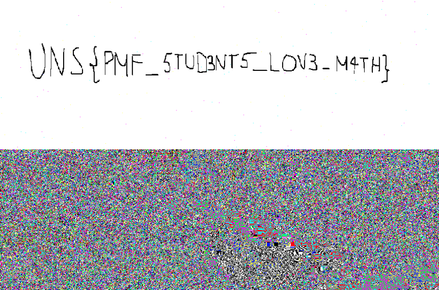
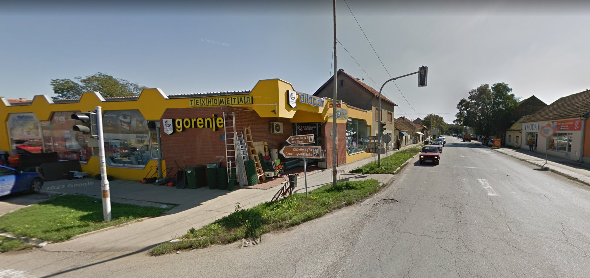
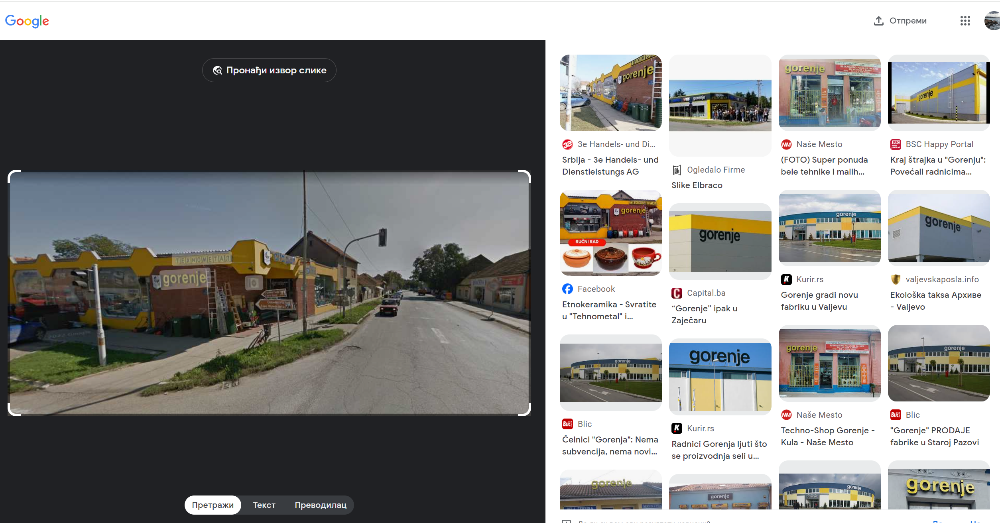
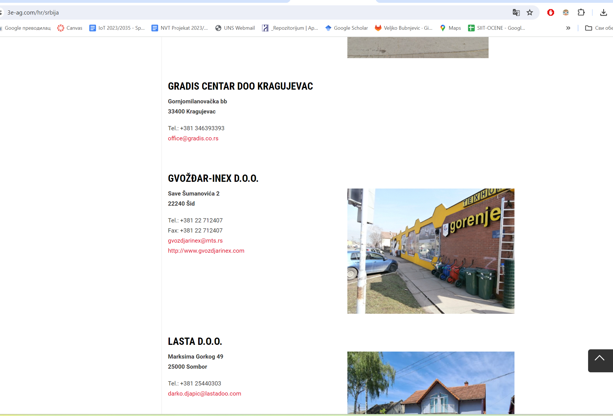
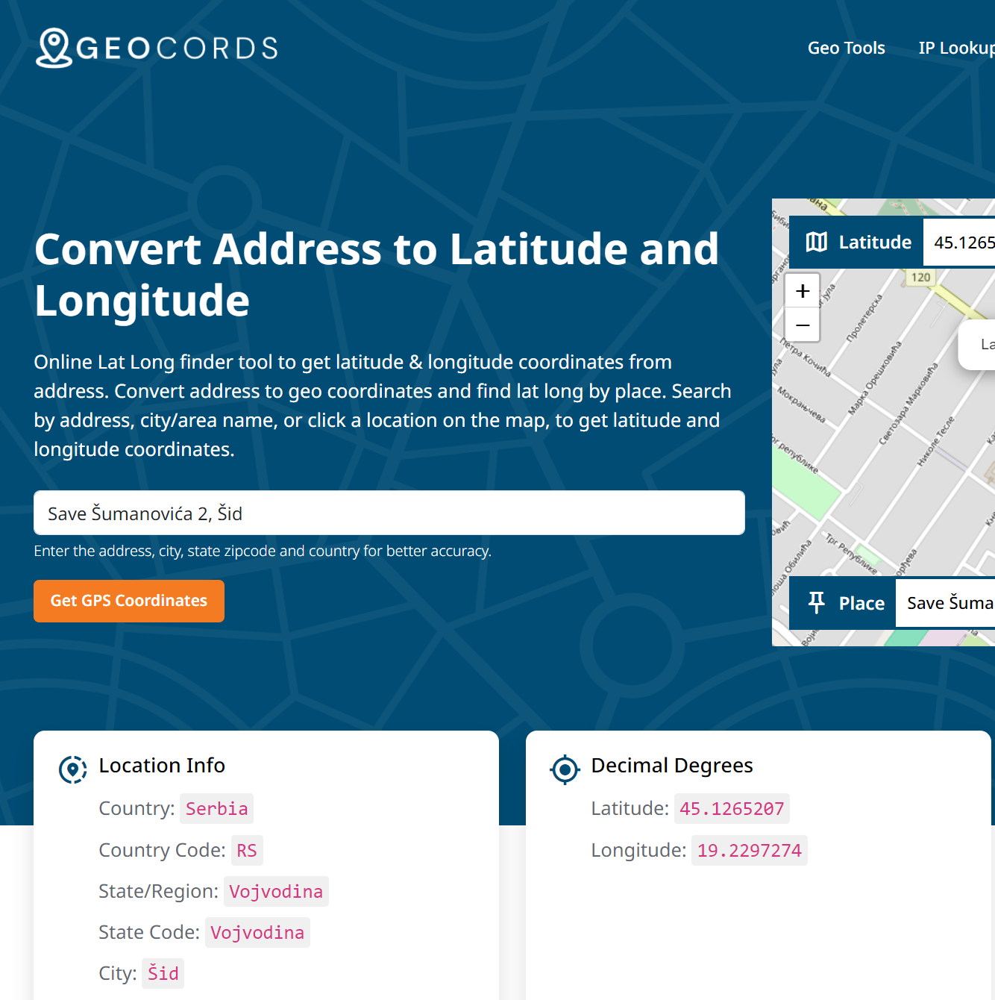
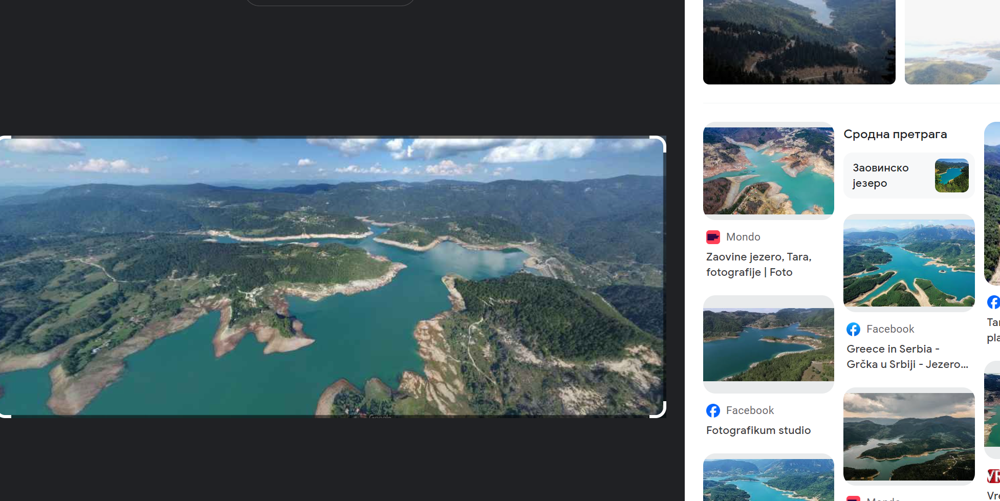
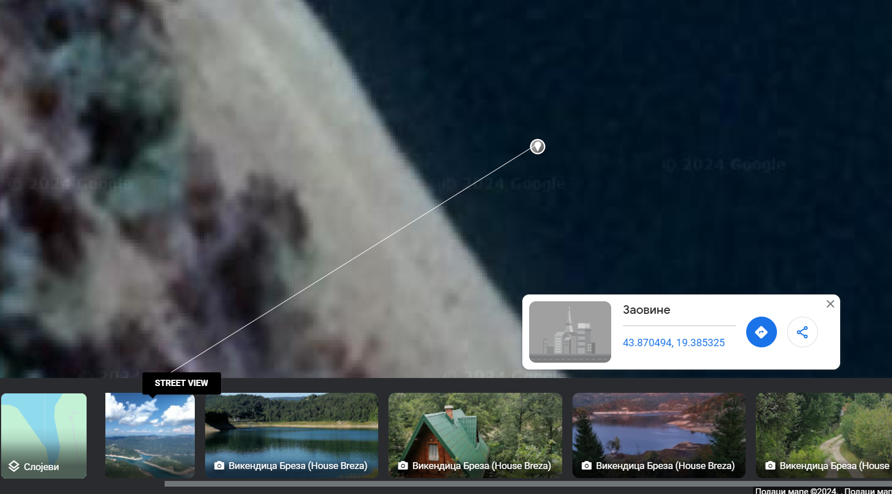

# OSINT ZADACI

## SV22/2020 Anja Petković

### Zadatak 4 - Nigerian prince

- U mejlu je Senate bill 1622 , Title 8 ; Section 308 .

- <https://www.vbforums.com/showthread.php?157720-Decode-the-SPAM> prvi rezultat pretrage

- Na blogu ima link ka alatu za dekodiranje <https://www.spammimic.com/decode.shtml>

- Rešenje zadatka je dobijeno dekodiranjem maila na datom sajtu (**UNS{EM4IL_5P4M_AG4N?}**)

### Zadatak 5 - Educational purposes only

1. Date when Faculty of Technical Sciences officialy opened. (Date Format : DD/MM/YYYY)

- MD5 : 02c3890bb0b03a24b99c3e4a39f18c44
- Odgovor: 28/06/1960
- Pronadjeno na: <https://en.wikipedia.org/wiki/University_of_Novi_Sad_Faculty_of_Technical_Sciences>

2. First name of the person who held the position of dean at the faculty from 01.10.1975. until September 30, 1977. ?

- MD5 : 06904f68128802c069e782b772e85eda
- Odgovor: Dragutin
- Pronadjeno na: <http://www.ftn.uns.ac.rs/n508315396/istorijat-funkcije-dekan>

3. The date when the FTN website was launched. (Date Format : DD/MM/YYYY)

- MD5 : f4d7caf81e33bc156cc3e98cf8095d2e
- Odgovor: 18/05/2005
- Pronadjeno na: <http://www.ftn.uns.ac.rs/102746447/novi-sajt>

4. The year when studies in the field of "Poštanski saobraćaj i telekomunikacije" were introduced.

- MD5 : 5ec829debe54b19a5f78d9a65b900a39
- Odgovor: 1999
- Pronadjeno na: <http://www.ftn.uns.ac.rs/n1243898707/faculty-of-technical-sciences>

- Lozinka za rar arhivu: **18/05/1960Dragutin18/05/20051999** dobijena je spajanjem svih odgovora na pitanja
- U sadrzaju arhive je slika sa flegom: (**UNS{V3RY_OLD_4RCH1V3}**)

## SV64/2020 Branislav Stojković

### Zadatak 6 - Pixel Perfect

1. Tvoj kolega sa fakulteta voli da se bavi fotografijom u slobodno vreme. Nedavno ti je poslao sliku i rekao da ima nešto vrlo važno da ti kaže. Od tada, nema nikakvog traga od njega. Možda bi trebalo da bolje pogledaš sliku?

- Format flaga: UNS{}
- Odgovor: UNS{PMF_STUD3NT5_LOV3_M4TH}
- Pronađeno na: Aperi solve sajtu gde je slika bila razložena na RGB komponente

### Zadatak 7 - The Queen of the Ocean

1. U 2020. godini Kraljica Okeana je uhvaćena i označena. Danas se pitamo kada je poslednji put pingovana?

- Format flega: RC15{Jan 15, 2021, 10:01:55 AM}

- Informacije o ajkuli Nukumi možete pronaći na sledećem linku: <https://sg.news.yahoo.com/50-old-great-white-shark-082339136.html?guccounter=1>
  - Ovaj članak govori o 50-godišnjoj velikoj beloj ajkuli imena Nukumi, koja je uhvaćena i označena 2020. godine.
- Putanja i poslednji ping ajkule Nukumi su dostupni na: <https://www.ocearch.org/tracker/detail/nukumi>

  - Na ovom linku možete videti kretanje ajkule Nukumi.
  - Poslednji put je pingovana 11. aprila 2021. godine u 15:03:07 sati.

- Odgovor: RC15{Apr 11, 2021, 3:03:07 PM}
- Pronadjeno na: <https://www.ocearch.org/tracker/detail/nukumi>

### Zadatak 8 - Squid Game Invitation

1. Na slici imamo email squidgameph1337@gmail.com i pronašli smo na Google pretrazi njegov GitHub sa repozitorijumom squidgame.

- Format flega: NAVY{}
- Informacije pronađene pretragom:

  - Na GitHub profilu smo pronašli repozitorijum pod nazivom squidgame.
  - U fajlu `index.html` nalazi se sledeći kod: `
NAVY{h4v3_y0u_3v3r_w4tched_!t?}
`

- Odgovor: NAVY{h4v3*y0u_3v3r_w4tched*!t?}
- Pronađeno na: GitHub repozitorijum squidgame u commitovima
- Poslednji commit je updateovao flag u fileu `index.html`

## SV51/2020 Veljko Bubnjević

#### 9. Data je fotografija:

Potrebno je pronaći lokaciju ovog mesta sa fotografije u obliku njenih koordinata.

Na, početku slika je uneta u Google Lens i bilo je potrebno pronaći fotografiju koja najbliže odgovara ovoj fotografiji:

Kada je pronađena fotografija, posetili smo sajt na kom se fotografija nalazi i pronašli adresu ove lokacije:

U pitanju je adresa: Save Šumanovića 2, 2240 Šid Srbija. Potom je adresa uneta u GEOCORDS i dobili smo koordinate lokacije: UNS{45.1265207, 19.2297274}

#### 10. Data je fotografija:

Potrebno je pronaći lokaciju ovog mesta sa fotografije u obliku njenih koordinata.

Prvo smo koristili Google Lens kako bismo dobili informaciju o pretpostavki gde bi ova fotografija bila uslikana (na fotografiji se nazira ispis *Google*- slika se nalazi na Google Maps). Pretpostavka koja je dobijena je da je u pitanju Zaovinsko jezero.

Zatim smo poseliti Google Maps i pronašli Zaovinsko jezero ručnom pretragom kako bismo bili sigurni da je u pitnanju područje sa ove fotografije.  Pronađena je identična slika koja je uslikana 2022 gudine u opciji Layers, i dobijene su koordinate: UNS{43.8704940, 19.3853250}

