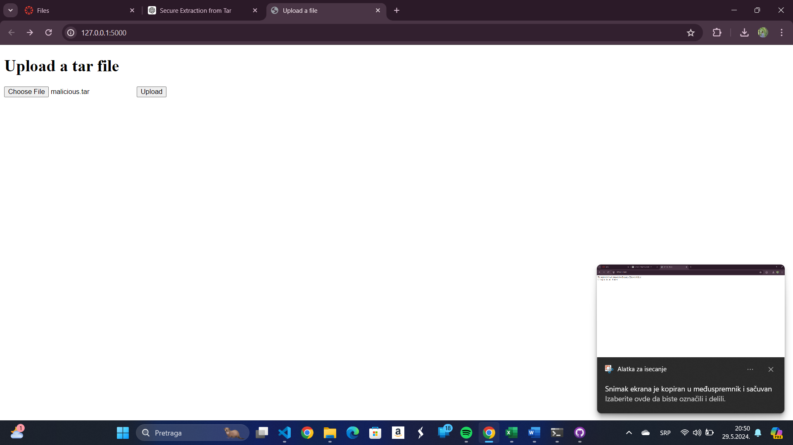
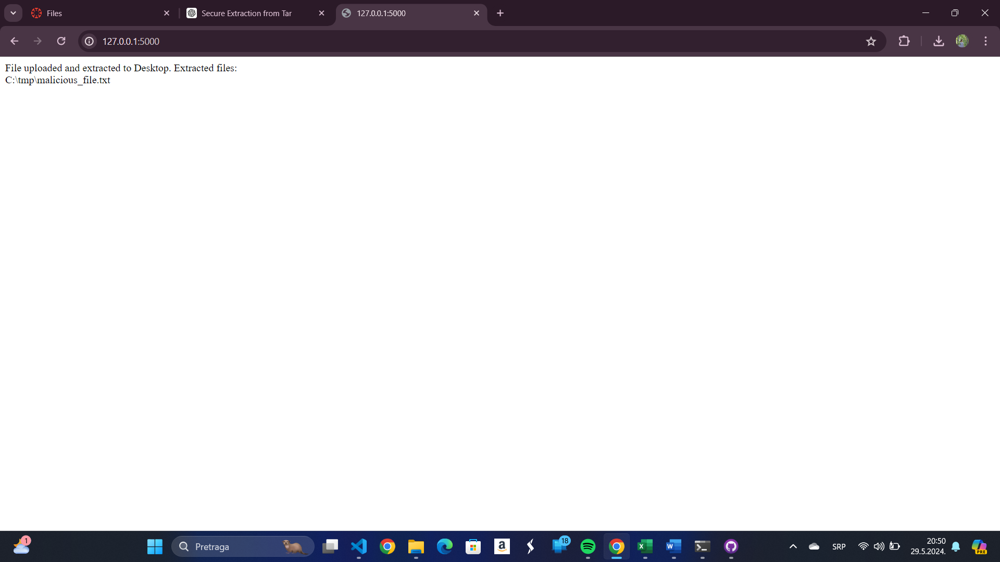
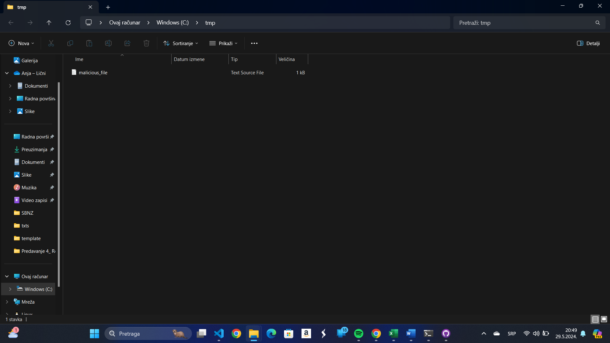
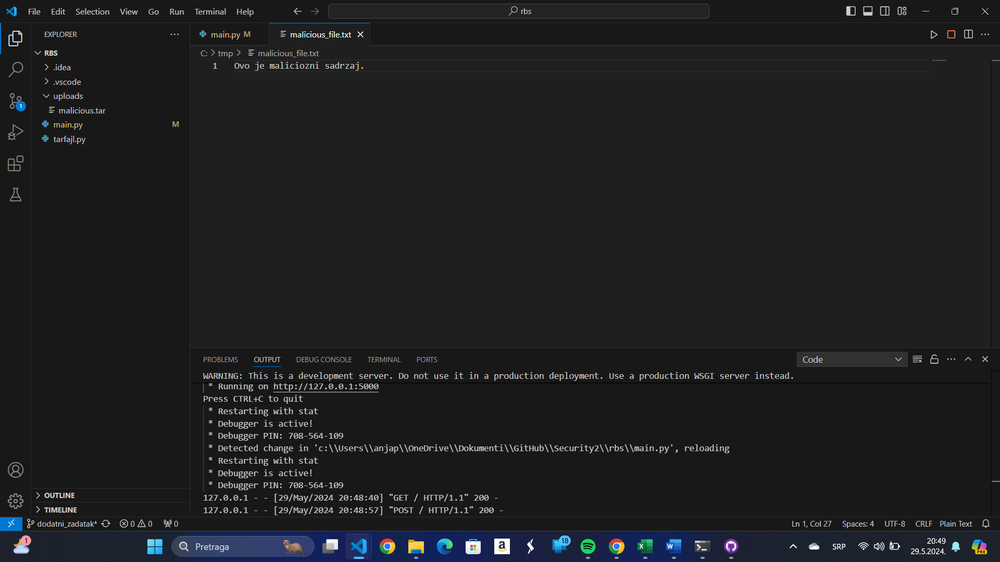

# Izveštaj: Otpremanje i Ekstrakcija Tar Fajlova koristeći Flask

## Uvod

Cilj ovog projekta bio je da napravimo Flask aplikaciju koja omogućava otpremanje tar fajlova i njihovu ekstrakciju na desktop korisnika. Dodatno, kreirali smo maliciozni tar fajl kako bismo testirali sigurnosne aspekte aplikacije, posebno prelazak direktorijuma (`../`).

## Koraci

### 1. Kreiranje Malicioznog Tar Fajla

Prvi korak je bio kreiranje malicioznog tar fajla koji sadrži fajl sa putanjom koja koristi prelazak direktorijuma. Ovo je bilo ključno za testiranje sigurnosti aplikacije.

1. **Definisali smo sadržaj** koji će biti upisan u maliciozni fajl.
2. **Odredili smo putanju do desktopa** koristeći funkciju koja pronalazi putanju do kućnog direktorijuma i dodaje `Desktop` na kraju.
3. **Kreirali smo privremeni fajl** sa malicioznim sadržajem.
4. **Kreirali smo tar arhiv** sa putanjom koja koristi prelazak direktorijuma (`../../../../tmp/malicious_file.txt`).
5. **Obrisali smo privremeni fajl** nakon kreiranja tar arhiva.

Nakon pokretanja skripte, maliciozni tar fajl `malicious.tar` je kreiran i sačuvan na našem desktopu.

### 2. Flask Aplikacija za Otpremanje i Ekstrakciju Tar Fajlova

Napravili smo Flask aplikaciju koja omogućava korisnicima da otpreme tar fajlove. Aplikacija zatim ekstraktuje fajlove na desktop korisnika.

1. **Definisali smo HTML formu** za otpremanje fajlova. Forma sadrži polje za odabir fajla i dugme za otpremanje.
2. **Implementirali smo rutu** koja obrađuje POST zahteve za otpremanje fajlova. Proveravamo da li je fajl deo zahteva i da li je izabran fajl.
3. **Sačuvali smo fajl** na desktop korisnika koristeći putanju do desktopa.
4. **Proveravamo da li je otpremljeni fajl** validan tar arhiv.
5. **Ekstraktujemo fajlove** na desktop korisnika i beležimo njihove putanje.
6. **Prikazujemo poruku korisniku** koja sadrži listu svih ekstraktovanih fajlova.

### 3. Testiranje

1. **Kreirali smo maliciozni tar fajl** koristeći Python skriptu.
2. **Pokrenuli smo Flask aplikaciju** iz komandne linije.
3. **Otvorili smo web pretraživač** i otišli na lokalnu adresu aplikacije (http://127.0.0.1:5000/).
4. **Koristili smo formu** za otpremanje tar fajla (`malicious.tar`).

### 4. Provera Ekstrakcije

Nakon što smo otpremili tar fajl, proverili smo da li su fajlovi ekstraktovani na naš desktop. Takođe smo proverili poruku koja prikazuje gde su fajlovi ekstraktovani.

### Stanje Nakon Ekstrakcije

- **Izgled servera**: Slika prikazuje kako izgleda server nakon pokretanja Flask aplikacije.
- **Odgovor nakon ekstrakcije**: Prikaz odgovora koji smo dobili nakon otpremanja i ekstrakcije fajla.
- **Sadržaj fajla**: Prikaz sadržaja fajla koji je ekstraktovan.

## Zaključak

Uspeli smo da kreiramo Flask aplikaciju koja omogućava otpremanje i ekstrakciju tar fajlova na desktop korisnika. Takođe smo uspešno testirali kako aplikacija reaguje na maliciozne tar fajlove koji koriste prelazak direktorijuma. Aplikacija je ispravno obradila i ekstraktovala fajlove, a poruke su jasno prikazale gde su fajlovi ekstraktovani.
