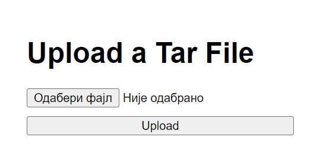
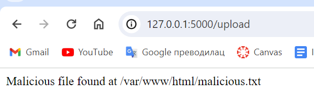

# Izveštaj: Otpremanje i Ekstrakcija Tar Fajlova koristeći Flask

## Uvod

Cilj ovog projekta bio je da napravimo Flask aplikaciju koja omogućava otpremanje tar fajlova i njihovu ekstrakciju na desktop korisnika. Dodatno, kreirali smo maliciozni tar fajl kako bismo testirali sigurnosne aspekte aplikacije, posebno prelazak direktorijuma (`../`).

## Koraci

### 1. Kreiranje Malicioznog Tar Fajla

Prvi korak je bio kreiranje malicioznog tar fajla koji sadrži fajl sa putanjom koja koristi prelazak direktorijuma. Ovo je bilo ključno za testiranje sigurnosti aplikacije.

1. **Definisali smo sadržaj** koji će biti upisan u maliciozni fajl.
2. **Odredili smo putanju do desktopa** koristeći funkciju koja pronalazi putanju do kućnog direktorijuma i dodaje `Desktop` na kraju.
3. **Kreirali smo privremeni fajl** sa malicioznim sadržajem.
4. **Kreirali smo tar arhiv** sa putanjom koja koristi prelazak direktorijuma (`../../../../tmp/malicious_file.txt`).
5. **Obrisali smo privremeni fajl** nakon kreiranja tar arhiva.

Nakon pokretanja skripte, maliciozni tar fajl `malicious.tar` je kreiran i sačuvan na našem desktopu.

### 2. Flask Aplikacija za Otpremanje i Ekstrakciju Tar Fajlova

Napravili smo Flask aplikaciju koja omogućava korisnicima da otpreme tar fajlove. Aplikacija zatim ekstraktuje fajlove na desktop korisnika.

1. **Definisali smo HTML formu** za otpremanje fajlova. Forma sadrži polje za odabir fajla i dugme za otpremanje.
2. **Implementirali smo rutu** koja obrađuje POST zahteve za otpremanje fajlova. Proveravamo da li je fajl deo zahteva i da li je izabran fajl.
3. **Sačuvali smo fajl** na desktop korisnika koristeći putanju do desktopa.
4. **Proveravamo da li je otpremljeni fajl** validan tar arhiv.
5. **Ekstraktujemo fajlove** na desktop korisnika i beležimo njihove putanje.
6. **Prikazujemo poruku korisniku** koja sadrži listu svih ekstraktovanih fajlova.

### 3. Testiranje

1. **Kreirali smo maliciozni tar fajl** koristeći Python skriptu.
2. **Pokrenuli smo Flask aplikaciju** iz komandne linije.
3. **Otvorili smo web pretraživač** i otišli na lokalnu adresu aplikacije (http://127.0.0.1:5000/).
4. **Koristili smo formu** za otpremanje tar fajla (`malicious.tar`).

### 4. Provera Ekstrakcije

Nakon što smo otpremili tar fajl, proverili smo da li su fajlovi ekstraktovani na naš desktop. Takođe smo proverili poruku koja prikazuje gde su fajlovi ekstraktovani.

### Stanje Nakon Ekstrakcije

- **Izgled servera**: Slika prikazuje kako izgleda server nakon pokretanja Flask aplikacije.
- **Odgovor nakon ekstrakcije**: Prikaz odgovora koji smo dobili nakon otpremanja i ekstrakcije fajla.
- **Sadržaj fajla**: Prikaz sadržaja fajla koji je ekstraktovan.


## Zaključak

Uspeli smo da kreiramo Flask aplikaciju koja omogućava otpremanje i ekstrakciju tar fajlova na desktop korisnika. Takođe smo uspešno testirali kako aplikacija reaguje na maliciozne tar fajlove koji koriste prelazak direktorijuma. Aplikacija je ispravno obradila i ekstraktovala fajlove, a poruke su jasno prikazale gde su fajlovi ekstraktovani.


# Veljko Bubnjević SV51-2020

### Implementacija Ranjivosti

- Kreirana je jednostavna web aplikacija pomoću *Flask* biblioteke u
  programskom jeziku Python

- Napravljen je jednostavan frontend sa HTML, CSS i JavaScriptom koji
  omogućava upload *tar* arhive.

- Implementirana je ruta za prijem upload-ovane arhive i ekstrakciju
  fajlova bez validacije putanja

### Analiza ranjivosti

- Identifikovana je ranjivost CVE-2007-4559, koja se odnosi na
  ekstrakciju *tar* arhive bez validacije putanja.

- Ova ranjivost omogućava napadaču da izvrši ekstrakciju fajlova izvan
  ciljanog direktorijuma, što može dovesti do korišćenja sistema ili
  krađe podataka.

### Kreiranje malicioznog fajla:

- Koristeći skriptu *make_tar_file.py* napravljen je *malicious.txt*
  fajl, koji je privremeno smešten u direktorijum u kom se nalazi sama
  aplikacija
```
  os.makedirs('malicious/var/www/html', exist_ok=True)
with open('malicious/var/www/html/malicious.txt', 'w') as f:
    f.write('This is a malicious file')
with tarfile.open('malicious.tar', 'w') as tar:
    tar.add('malicious/var/www/html/malicious.txt', arcname='/var/www/html/malicious.txt')
  ```

### Postavljanje napada:

- Napadač kreira malicioznu *tar* arhivu sa malicioznim fajlom
  (*malicious.txt*) i putanjom koja izlazi van ciljanog direktorijuma
  (*/var/www/html/).*

- Koristeći ranjivu tačku za *upload* na web aplikaciji, napadač
  uploaduje malicioznu arhivu (*malicious.tar*).



- Arhiva se uspešno ekstraktuje na serveru bez ikakve validacije
  putanja. Ovo je urađeno upotrebom *shutil.move* metode koja prima dva
  parametra, *src_path –* lokacija kreiranog malicioznog fajla,
  *dst_path –* lokacija gde treba maliciozni fajl da se ekstrahuje
``` shutil.move(src_path, dst_path)```

- Maliciozni fajl se nalazi na neželjenoj lokaciji, van ciljanog
  direktorijuma (*/var/www/html/).*

- Na ekranu se ispisuje informacija ako se zaista fajl zaista nalazi izvan ciljnog direktorijuma



### Zaključak:

- CVE-2007-4559 ranjivost je uspešno iskorišćena u aplikaciji koja
  omogućava ekstrakciju *tar* arhive bez validacije putanja.

- Ovaj napad omogućava napadaču da uđe u sistem i izvrši zlonamerne
  radnje kao što su krađa podataka ili kontrola servera.

- Aplikacija bi trebalo da implementira validaciju putanja prilikom
  ekstrakcije arhive kako bi se sprečila ovakva vrsta napada.
