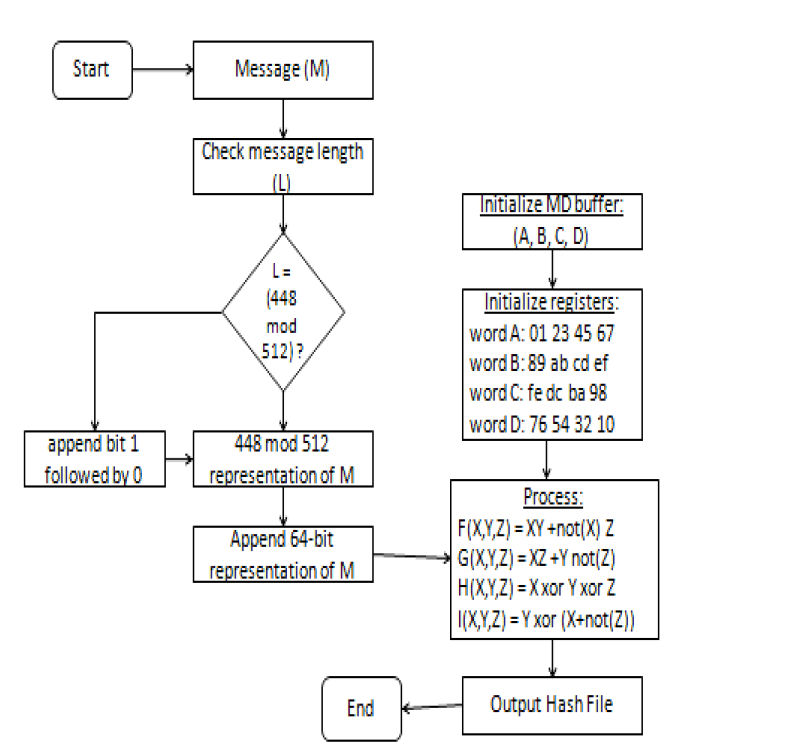
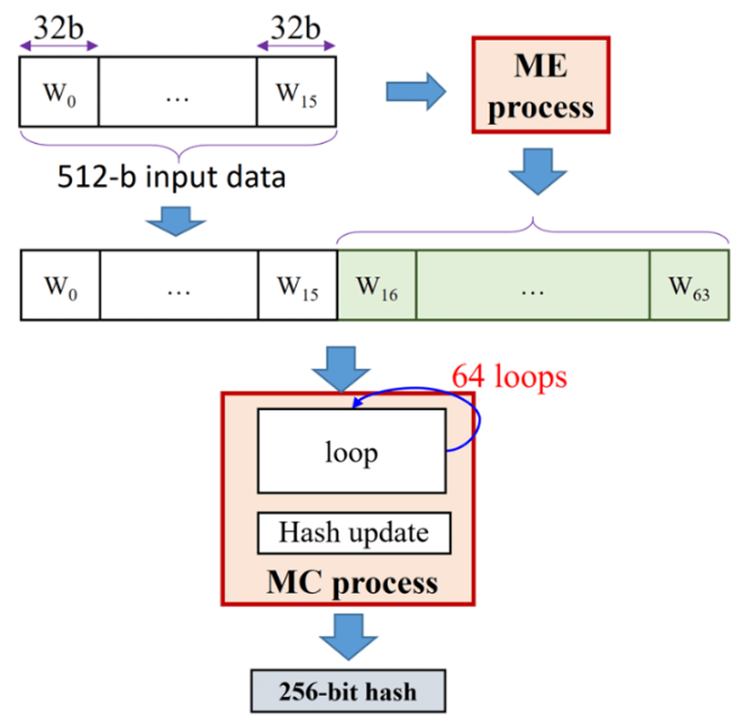

# HEŠOVANJE LOZINKI

Sa razvojem informacionih sistema i aplikacija javlja se potreba sa očuvanjem privatnosti podataka kako samog sistema, tako i subjektima samog sistema. Najpopularniji način za očuvanje privatnosti i kontrolisani pristup  poverljivim podacima u sistemu je upoteba lozinki. Lozinka često zbog samih loših navika korisnika ili zbog njene jednostavnosti u strukturi može biti jako podložna napadima. S vremenom se pojavio način koji je dosta popravio zaštitu od napada, tako što je smislen mehanizam koji štiti lozinke od njihovog otkrivanja. Ovo se može postići upotrebom različitih kriptografskih algoritama. Osnovna ideja je sledeća: Postoji odgovarajuća *hash* funkcija koja izvornu lozinku pretvara u niz karaktera fiksne dužine. Ovo omogućava da izvorna lozinka, kreirana od strane samog korisnika, bude pohranjena u bazi podataka kao rezultat primene  *hash* funckije. Na taj način subjekti koji imaju pristup bazi podataka neće znati izvornu lozinku klijenta, nego će moći da vide samo njenu heširanu vrednost. Kada se korisnik ponovo prijavljuje na sistem, kako bi izvršio autentifikaciju, on unosi izvornu lozinku, lozinka se algoritmom hešuje i poredi sa vrednošću u bazi. Ako su vrednosti iste smatra se da je korisnik autentifikovan. Mogućnost otkrivanja izvorne lozinke na osnovu heširane vrednosti je proces oktrivanja inverzne *hash* funkcije. Kako bi se ovaj proces znatno otežao vremenom su razvijeni različiti algoritmi koji omogućavaju bolju zaštitu .

## MD5 ALGORITAM

MD5 (*Message-Digest Algorithm*) je algoritam koji je nastao 1991. godine i razvijen je od strane Ronalda Rivesta. Razvijen ja na osnovu MD4 algoritma ali je dosta sigurniji i brži od njega. Dužina digesta ovog algoritma je 128 bita, zbog čega neki kritičari misle da je podložan *force birthday attack* napadima. Danas se relativno retko koristi u kriptografiji za hešovanje lozinki i potpisivanje digitalnih dokumenata, najviše iz razloga što se smatra da je prevaziđen.

Prikaz algoritma. Slika preuzeta iz [2]. 

OPIS ALGORITMA:

Inicijaliziraju se četiri 32-bitne reči (A, B, C, D), koje će biti korišćene za generisanje konačne hash vrednosti. Uazna poruka (M) se nadopunjuje tako da bude celi broj blokova od 512 bitova. Ovo uključuje dodavanje jednog bita postavljenog na 1, a ostatak bitova na 0, i dodavanje informacije L o dužini izvorne poruke na kraju. Nadopunjena poruka se deli na blokove od 512 bitova. Za svaki blok, reči A, B, C i D se inicijalizuju na početne vrednosti. Svaki blok se obrađuje koristeći niz iterativnih koraka koji menjaju stanje reči A, B, C i D na temelju bloka i trenutnog stanja. Nakon što su svi blokovi obrađeni, konačno stanje reči A, B, C i D se kombinuje kako bi se generisala 128-bitna *hash* vrednost. Konačna *hash* vrednost se obično prikazuje kao niz od 32 heksadecimalna znaka. 

RAZBIJANJE ALGORITMA:

17\. avgusta 2004. godine, grupa inženjera (*Wang,  Feng,  Lai, Yu*) je uspešno razbila algoritam pronašavši koliziju nad algoritmom za samo sat vremena. Nedugo zatim, u martu 2005. godine algortiam je ponovo razbijen, tako što je autor Vlastimil Klima uspeo da napravi algoritam koji na običnom laptopu može da izazove koliziju algoritma.

Iako je MD5 algoritam bio široko korišćen, danas se smatra zastarelim zbog poznatih ranjivosti. 

## BCRYPT ALGORITAM

*Bcrypt* algoritam je osnovan 1999. godine od strane inženjera *Niels Provos* i *David Mazières.* Osnovna namena ovog algoritma bila je heširanje lozinki. Ovaj algoritam koristi tehniku koja se zove soljenje (*eng. salting*), koja uključuje dodavanje nasumičnih vrednosti koja se zove so svakoj lozinki pre heširanja. So se čuva pored heša, što ga samim tim čini jedinstvenim za lozinku. Ovaj mehanizam sprečava napade na unapred izračunate tabele i obezbeđuje da čak identične lozinke imaju različite hešove. Još jedna karakteristika ovog algortma je *protezanje ključa* pri čemu se kontroliše broj iteracija koje algoritam izvodi. 

| ***INPUT**: (cost, salt, key)*                                                                                                                                                                                                                                |
|---------------------------------------------------------------------------------------------------------------------------------------------------------------------------------------------------------------------------------------------------------------|
| ***OUTPUT**: hash*                                                                                                                                                                                                                                            |
| 
*state ← EksBlowfishSetup(cost, salt, key)*

*ctext ← “OrpheanBeholderScryDoub”* 

***repeat** (64)*

&nbsp; &nbsp; &nbsp; &nbsp; &nbsp; &nbsp; *ctext ← EncryptECB (state, ctext);*

***return** Concatenate(cost, salt, ctext);*
 |

Prvo se generiše  nasumična so (*salt*), koja je nasumično generisan podatak. So se obično sastoji od niza znakova i dodaje se lozinki prie heširanja. Postoji i radni faktor (*cost*) koji određuje koliko će vremena biti potrebno za izračunavanje heš vrednosti. Lozinka, zajedno sa solju, šalje se kroz *bcrypt* algoritam. Algoritam obavlja više iteracija koristeći rezultat prethodne iteracije kao ulaz za sledeću. Ovo omogućuje algoritmu da bude adaptivan, što znači da može usporiti napade povećavajući vreme izračunavanja. Ovaj proces osigurava da je bcrypt otporan na *"brute force"* napade. Kada korisnik želi proveriti lozinku, isti postupak se ponavlja. So se izvlači iz pohranjene *hash* vrednosti, a zatim se lozinka zajedno s tom solju šalje kroz *bcrypt* algoritam. Ako dobivena hash vrednost odgovara sačuvanoj *hash* vrijednosti, lozinka je ispravna.

Ograničenja u pogledu ovog algoritma su sledeća:

1. *Bcrypt* algoritam ima ograničenje na dužinu lozinke od 72 bajta.
1. On je relativno spor algoritam u poređenju sa drugim algoritmima.
1. Memorijski intentzivan.
1. Postoji mogućnost generisanja iste soli za identične lozinke.

## SHA - 256

SHA-256 algoritam (*Secure Hash Algorithm*) je algoritam kreiran od strane Nacionalne Bezbednosne Agencije 2001. godine. Osnovna ideja ovog algoritma je da prozvede hash vrednost čija je dužina 256 bita. Karakteristike ovog algoritma su: 

- Dužina poruke – dužina otvorenog teksta trebala bi biti manja od 264 bita
- Dužina *hash* vrednosti je 256 bita  ako se koristi SHA-256
- Ireverzibilnost: sve *hash* vrednosti koje generiše SHA-256 su nepovratn. Originalna vrednost se ne bi trebala dobiti kada ponovo provlačimo vrednost kroz *hash* funkciju.

Proces heširanja. Slika preuzeta iz [1].

Na početku algoritma se dodaju dodatni bitovi u poruku tako da dužina poruke bude tačno 64 bita manja od umnoška broja 512. Tokom sabiranja prvi bit treba da bude 1, a ostatak treba da bude popunjen nulama, a zatim se vrši dodavanje dužine originalne poruke u bitovima.  512-bitni ulazni blok se deli na šesnaest 32-bitnih reči, a zatim biva proširen na 64 32-bitne reči kroz niz logičkih operacija. Proširena poruka se zatim obrađuje u petlji od 64 iteracije, pri čemu izlaz jedne iteracije predstavlja ulaz u drugu operaciju. U svakoj iteraciji se generisana *hash* vrednost rotira po određenom obrascu i dodaju se dodatni podaci.  Ceo ciklus se ponavlja sve dok se ne dođe do poslednjeg 512-bitnog bloka a njegov izlaz se smatra konačnom *hash* vrednošću.  

### Ranjivost

SHA-256 i SHA-512 su podložni napadima produžetka dužine. Ovi napadi omogućavaju napadaču da dodaju dodatne podatke na kraj originalne poruke, a zatim generišu novu heš-vrednost koja se čini validnom. Ovo može biti problematično jer se originalna poruka može promeniti na način koji nije očigledan prilikom provere heš-vrednosti. Kod SHA-224 i SHA-384, iako su slični SHA-256 i SHA-512, postoji određena poboljšanja koja čine ove napade manje uspešnim. Ipak, napadač može pokušati da pogodi skriveni deo stanja algoritma kako bi izveo napad. Verovatnoća uspeha ovog napada za SHA-224 je 2-32 što čini da postoji mogućnost napada, ali je verovatnoća veoma mala.

SHA-256 algoritam se danas smatra standardom za heširanje i verifikaciju digitalnog potpisa i mnogih drugih operacija vezanih za bezbednost. Smatra se da je ovo trenutno najbezbedniji način autentifikacije jer razbijanje ovakvog algoritma je moguće samo ukoliko se poseduju neograničeni resursi i vreme.

## ODABRANI ALGORITAM

Iz svega gore navedenog možemo da zaključimo da SHA-256 algoritam zbog samog dizajna i ireverzibilnosti kao i standarda koje ima može da se smatra najbezbednijim algoritmom. 

Neke dopunjujuće prakse

Ukoliko se koristi heširanje vrednosti upotrebom SHA-256 algoritma, jedna od preporuka je korišćenje generisane soli, tj. nasumično generisanog podatka koji se dodaje lozinki na kraj ili početak, kako bi se izbegla mogućnost pojave dve iste *hash* vrednosti. Konačna *hash* vrednost bi u tom slučaju izgledala ovako:

$SaltedHash = SHA256(password + salt)$

Ono na šta treba obratiti pažnju jeste da ne dođe do upotrebe iste soli za različite lozinke. Ukoliko se ista so dodaje različitim lozinkama svaki put, korisnici sa istom lozinkom imaće istu heširanu so, i ako napadač može da pogodi so, moći će vrlo lako da izvrši “*brute-force*” napad.

SHA-256 algoritam može biti koriščen u kombinaciji sa heš funkcijama baziranim na ključu (*Keyed-Hash Functions, KHF*). Jedna široko prihvaćena implementacija KHF u kombinaciji sa SHA-256 je *HMAC-SHA256*. Ova konstrukcija kombinuje SHA-256 *hash* funkciju sa tajnim ključem kako bi se obezbedio siguran i efikasan mehanizam autentifikacije poruke. Ugrađivanjem tajnog ključa u proces heširanja ove funkcije nude pouzdan način zaštite.

## PROVAJDER
Jedan od pouzdanih provajdera može se smatrati OpenSSL. OpenSSL je već dugi niz godina široko korišćena i uspostavljena kriptografska biblioteka. Iako postoje alternative, OpenSSL ima nekoliko prednosti koje su doprinele njegovoj popularnosti.

- Zrelost i široko usvajanje - OpenSSL se koristi dugo vremena i testiran je u velikom broju aplikacija. Njegova zrelost i široka primena doprinose njegovoj pouzdanosti i stabilnosti.
- Zajednica i dokumentacija - OpenSSL ima veliku, aktivnu zajednicu korisnika i programera, što rezultira boljom podrškom, ispravkama grešaka i sigurnosnim ažuriranjima. Osim toga, postoji mnogo resursa i dokumentacije za učenje i rešavanje problema.
- Bogat funkcijama - OpenSSL pruža sveobuhvatan skup kriptografskih funkcija, protokola i alata, što ga čini pogodnim za širok spektar aplikacija i slučajeva upotrebe. Osim SSL/TLS-a, također podržava različite algoritme šifriranja, upravljanje ključevima i operacije vezane za sertifikate.
- OpenSSL se redovno ažurira i svaka nova ranjivost biva detaljno pregledana.

Zadnja prijavljena ozbiljnija ranjivost (*High severity)* zabeležena je 7.2.2023. godine, koja je omogućavala napadaču da prosledi proizvoljne pokazivače na *memcmp* poziv, omogućavajući mu da pročita sadržaj memorije ili izvrši uskraćivanje usluge. U većini slučajeva, napad zahteva od napadača da obezbedi i lanac sertifikata i CRL, od kojih nijedan ne mora da ima važeći potpis. Greška je otlonjena od strane inženjera *Hugo Landau-a.*

## ZAHTEVI ZA BEZBEDNU IMPLEMENTACIJU HASH MEHANIZAMA

1. Odabir aktuelno najoptimalnijeg algoritma za *hash*. Prema gore navedenom tekstu to bi mogao biti SHA-256.
1. Razmotriti kome je sistem koji se razvija ključan i koliko je bitna pouzdanost samog sistema. Ukoliko se razvija strogo poverljiv sistem onda treba razmotriti kombinaciju nekih *hash* algoritama kao što je na primer korišćenje *SaltedHash-256* algoritma ili upotreba KHF funkcija.
1. Odabrati pouzdanog provajdera – OpenSSL. Trebalo bi pogledati da li zadnje verzije ovog provajdera imaju prijavljene nove ranjivosti, i ukoliko imaju neophodno je ažurirati biblioteku.
1. Implementirati *hash* algoritme upotebom biblioteka.

LITERATURA

[1] Tran, Thi Hong, Hoai Luan Pham, and Yasuhiko Nakashima. "A high-performance multimem SHA-256 accelerator for society 5.0." *IEEE Access* 9 (2021): 39182-39192.

[2] Nahak, Kirti, and Babita Kubde. "Security and Privacy issues in high level MANET protocol." *International Journal of science and research* 2 (2013): 1-7.

# Zadatak 2 - logovi

##  Log datoteke moraju pružiti informacije potrebne za razrešavanje problema;
#### Kada dođe do problema u sistemu, ukoliko je sistem dobro implementiran i ima log datoteke u koje se upisuju informacije pravilno, moguće je otkriti uzrok problema upravo iz ovih fajlova. Log fajlovi nam mogu sugerisati na grešku koja se dogodila u sistemu, izuzetak do kojeg je došlo ili maliciozne radnje korisnika koje su izvršene nad sistemom. Takođe se neke vrtse podataka iz log datoteka mogu vizualizovati i otkriti dodatne informacije o radu sistema ili akcijama korisnika. Svedoci smo sve češće upotrebe AI alata, te nam mogu i oni biti korisni prilikom identifikovanja problema u sistemu
### Koraci pri analizi logova: 
#### Pošto je više parametara moglo da doprinese grešci, prvi korak je utvrđivanje da li je greška u infrastrukturi, greška u praćenju ili greška u transakciji izazvala probleme u sistemu
#### Drugi korak bi bio analiza logova na granularnom nivou. Naime, ako smo otkrili koja je vrsta greške, sada treba dalje analizirati šta je uzrok greške i na kom mestu se ona u sistemu dogodila. Na primer, pretpostavimo da se veb lokacija pokvari. U tom slučaju, od vitalnog je značaja da se odmah utvrdi da li je razlog server aplikacija, server baze podataka ili problem sa korišćenjem CPU-a, memorije ili diska da biste precizno došli do osnovnog uzroka i pravilno identifikovali problem..
#### Treći korak bi eventualno bio da nakon otkrivanja greške napravimo strategiju za rešavanje problema i izračunamo cenu poravke.
### Struktura loga:
#### Najčešći sadržaj log zapisa: 
 - **Datum i vreme**
 - **Nivo ozbiljnosti (severity level)**
 - **ID procesa ili thread-a**
 - **Izvor događaja**
 - **Poruka**
 - **Kod greške ili izuzetka (Stack trace)**
 - **Korisnički identifikator**
 - **Dodatni kontekst**
### Najčešći formati log fajla: 
 - *Plain Text (Čist tekst)* 
 - *CSV (Comma-Separated Values)*
 - *JSON (JavaScript Object Notation)*
 - *XML (eXtensible Markup Language)*
 - *Syslog*
 - *Log4j*

## Svi događaji za koje su akteri bitni moraju biti zapisani, sa dovoljno informacija kako akteri ne bi mogli da poriču odgovornost (non-repudiation). Potrebno je obezbediti lako izdvajanje tih događaja;
### Neporecivost se može u kontekstu log fajlova posmatrati sa dva aspekta: 
#### **Neporecivost fajla**
Odnosi se na to da fajl sam po sebi nije menjan, tako da se originalni neobrađeni fajl evidencije može predstaviti kao dokaz, bez pitanja autentičnosti, na sudu
#### **Neporecivost zapisa u fajlu**
Može se sprovesti praćenjem sledećih bitnih koraka:
1. **Osiguranje integriteta i autentičnosti log zapisa** - Obežbeđuje se upotrebom digitalnih potpisa, prilikom potpisivanja se koristi privatni ključ, a provera se vrši odgovarajućim javnim ključem. Ovo nam dokazuje da log zapis u međuvremenu nije promenjen od strane trećeg lica. Integritet se dodatno može proveravati pomoću checksum-a ili hash vrednosti, kako ne bi došlo do neautorizovanih izmena.
1. **Enkripcija logova** - Šifrovanje će zaštititi poverljive informacije iz logova. Ukoliko dođe do toga da su logovi kompromitovani, bez odgovarajućeg algoritma za dekripciju, napadač ne može doći do njihovog sadržaja.
1. **Čuvanje logova na centralizovanom i sigurnom log serveru** - Ovaj postupak čuvanja sprečava maliciozne aktere da vrše manipulaciju logova i pristupaju log fajlovima ukoliko za to nemaju prava.
1. **Automatizacija prikupljanja i prenosa logova** - Ovo nas štiti od ljudskih grešaka i namernih manipulacija, ali i obezbeđuje sistem ukoliko dođe do otkaza. Osim ovoga, neophodno je sprovoditi i politike koje određuju koliko dugo logovi treba da se čuvaju, gde i kako.
1. **Korišćenje skladišta podataka koje se ne može menjati** - Ovo je dobra stvar jer kada se log jednom kada upiše u takvo skladište, on ne može biti izmenjen ni obrisan. Čak i pored ovakvih skladišta, pristup logovima treba omogućiti samo onim korisnicima kojima je to neophodno radi monitoringa ili verifikacije akcija.

## Stavke log datoteke ne smeju sadržati osetljive podatke
### Šta su osetljivi podaci: 
- **Identifikacioni podaci** (*puna imena, adrese, adresa e-pošte, broj vozačke dozvole i broj telefona*)
- **Finansijski podaci** (*podaci o kreditnoj kartici i drugi finansijski podaci*)
- **Podaci o zdravstvenoj zaštiti** (*istorija bolesti i kartoni*)
- **Lozinke** 
- **IP adresa** 
### Opasnosti evidentiranja osetljivih podataka
Prema zakonima o privatnosti kao što su GDPR u EU i CCPA u Kaliforniji korisnici imaju sledeća prava:
- Zatražite informacije o tome koji podaci o njima postoje
- Dobijte informacije o tome zašto se njihovi podaci čuvaju
- Zahtevajte brisanje ličnih podataka
Ispunjavanje bilo kog od ovih zahteva postaje izuzetno teško ako imate korisničke podatke duplirane po sistemima i raširene po vašim evidencijama i deponijama i rezervnim kopijama baze podataka.

Istorijski gledano, evidencije su često meta kršenja podataka ili izvor slučajnog curenja podataka. Čuvanje osetljivih podataka iz vaših evidencija je jednostavan način za rešavanje ovog problema. Napadi će se desiti, ali držanjem osetljivih podataka van evidencije, značajno smanjujete vrednost svih podataka koji budu ugroženi.

### Najbolje prakse za čuvanje osetljivih podataka iz evidencije
1. **Izolujte osetljive podatke**
1. **Zapišite tokene, a ne vrednosti**
1. **Šifrujte tokom tranzita i u mirovanju**
1. **Držite lične podatke van URL-ova**
1. **Redigujte i maskirajte podatke**
1. **Upravljajte podacima**

### Najbolje prakse za prevenciju grešaka
1. **Revidirajte kod često**
1. **Zapisujte isključivo strukturirane logove**
1. **Postavite automatska obaveštenja ukoliko dođe do opasnosti**

## Mehanizam za logovanje morabiti pouzdan, mora obezbediti dostupnost i integritet log datoteka;
### **Pouzdanost**
 - Sistem za logovaje u svakom trenutku mora biti sposoban da zabeleži svaki relevantan događaj u sistemu u odgovarajućem formatu, bez obzira na opterećenost i broj događaja koji se trenutno vrše u sistemu.
  - Sistem za logovanje mora biti otporan na greške, prekide u radu, ali i veliki broj zahteva za upisivanje u fajl.
  - Pouzdan sistem logovanja garantuje da će sve bitne informacije biti zabeležene u standardnom formatu i sa tačnim podacima.

### **Dostupnost**
 - Log datoteke moraju biti dostupne za pregled i analizu u svakom trenutku
 - Sistem za logovaje mora biti dizajniran tako da podržava visoku dostupnost, uključujući redundantnost i mehanizme za oporavak podataka u slučaju kvara. Kao što su replikacije podataka i sinhronizacija istih.
 - Dostupnost osigurava da se logovi mogu koristiti za brzo reagovanje na incidente ili probleme u realnom vremenu, kao i za dugoročne analize.

### **Integritet**
 - Integritet log datoteka je od suštinske važnosti za očuvanje njihove pouzdanosti kao dokaza u sigurnosnim istragama i analizama.
 - Sistem za logovaje mora biti dizajniran tako da uključuje mehanizme koji sprečavaju neautorizovanu izmenu, brisanje ili na bilo koji način kompromitovanje log datoteka.
 - Ovo obuhvata mehanizme digitalnih potpisa, enkripcije, i druge metoda zaštite podataka koji osiguravaju verifikaciju autentičnosti logova.

## Stavke log datoteke moraju precizno iskazati vreme nastanka;
Ova osobina log sistema je veoma važna za detekciju početka problema ili u distribuiranim sistemima, gde ne postoji globalni časovnik.
 - **Precizne vremenske oznake** omogućavaju da se hronološki prate zapisi. Ovo je ključno za kreiranje retrospektive događaja koji dovode do problema. Takođe nam je korisno u situacijama kada je potrebno analizirati uzroke problema ili sigurnosnih incidenata.
 - U okviru **distribuiranih sistema**, u kojima ne postoji globalni časovnik, a događaji se mogu dešavati na različitim mestima, od neizmerne je važnosti sinhronizacija log zapisa kako bismo utvrdili koja je uzročno-posledična veza između dva takva događaja.
 - Vremenske oznake su ključne i za **uspostavljanje odgovornosti** akcija korisnika unutar sistema. Tokom praćenja korisničkih aktivnosti ili forenžičke analize vremenske oznake nam omogućavaju povezivanje određenog korisnika sa tačnim događajem zapisanim u sistemu.
 - **Industrijski standardi i zakonske regulative** zahtevaju precizno logovanje vremena zbog *sigurnosti, privatnosti i revizije*. 

## Mehanizam za logovanje mora stremiti ka tome da su logovi uredni, da je “pretrpanost” minimalizovana;
Kako bismo minimizovali pretrpanost logova i izbegli neurednost neophodno je da primenimo sledeće strategije prilikom zapisivanja logova:
 1. Postaviti **nivo evidencije loga** (DEBUG, INFO, WARNING, ERROR, CRITICAL) radi kontrole opširnosti evidencije.
 1. Implementirati **rotaciju logova** radi automatskog arhiviranja starih datoteke evidencije i kreiranja novih nakon što evidencije dostignu određenu veličinu ili starost. Ovo nam je korisno za izbegavanje predugačkih log datoteka.
 1. Potrebno je često vršiti **uzorkovanje log fajla**. U velikim sistemima sa ogromnim protokom informacija nije realno čitati svaki log zapis, ali s vremena na vreme je potrebno uzorkovati neku kolčinu zapisa radi analize rada sistema.
 1. Kao što smo i do sada navodili, neophodno je log zapise u sistem unositi strukturirano i u određenom formatu. Radi lakše pretrage i filtriranja evidencije na osnovu specifičnih polja.
 1. Takođe, evidencija log zapisa se mora centralizovati. **Centralizovani sistem logovanja** objedinjuje evidenciju iz više izvora. Ovakvi sistemi često dolaze sa funkcijama za filtriranje, pretraživanje i upozorenja, a ovo nam omogućava da se fokusiramo samo na najvažnije informacije.
 1. Neophodno je implementirati mehanizme **filtriranja log fajla**, te pomoću njih isključiti pretragu zapisa koji nisu korisni ili relevantni iz skladišta. Filtriranje se može vršiti na izvornom nivou ili na nivou agregatora. 
 1. Nekada nije dovoljno samo voditi monitoring fajlova, potrebno je implementirati **mehanizme upozorenja i metrike** adekvatne za to.
 1. Uvek je potrebno razmotriti dužinu čuvanja log zapisa. Ukoliko se ovakvi fajlovi skladište najbolje prakse su servisi za **skladištenje** koji podržavaju automatsku **kompresiju** i upravljanje životnim ciklusom.
 1. Još jedna od dobrih praksi je i edukacija ostalih developera o struj+krturi log zapisa, jer se time može na početku izbeći pretrpanost fajlova.

# Zadatak 3 - Izveštaj o Bezbednosnoj Implementaciji i Poboljšanjima

Analiza i ocena bezbednosnih aspekata implementiranih u projektu za upravljanje digitalnim sertifikatima. Projekat omogućava korisnicima da registruju naloge, autentifikuju se, upravljaju digitalnim sertifikatima, i sprovode bezbednosne operacije kao što su izdavanje, povlačenje, i validacija sertifikata. Bezbednost informacija i zaštita privatnosti korisnika su od suštinske važnosti, zbog čega se posebna pažnja posvećuje implementaciji robustnih bezbednosnih kontrola.

## Korišćeni Algoritmi i Bezbednosni Aspekti

### **Korišćen heš algoritam**
Projekat koristi za autorizaciju autorizator **Auth0** koji implementira autentikaciju **Auth - N**. Za heširanje koristi **bcryptJS biblioteku** kroz Auth0 za hešovanje lozinki. BcryptJS koristi **bcrypt algoritam** za heširanje lozinki. Bcrypt algoritam se široko koristi za heširanje lozinki zbog svojih robustnih sigurnosnih karakteristika. Implementira i tehniku **salting**, što sprečava efikasno napade korišćenjem prethodno izračinatih heš tablica, poznatih kao dugine tabele (rainbow tables). Dodatno, bcrypt omogućava podešavanje broja prolaza kroz heširanje, što znatno otežava brute-force napade, jer svako povećanje broja prolaza eksponencijalno povećava vreme potrebno za izračunavanje heša. U projektu algoritam prolazi kroz heširanje 10 puta. Bcrypt algoritam još uvek nema otkrivene ranjivosti.

#### **Poboljšanje heš algoritma**
Iako bcrypt nema otkrivenih ranjivosti, postoji noviji algoritam **Argon2** koji je bio pobednk na Password Hashing Competition 2015. godine. Dizajniran je da bude otporan na različite vrste napada, uključujući napade pomoću specijalizovanog hardvera kao što su ASIC (Application-Specific Integrated Circuit) i FPGA (Field-Programmable Gate Array) uređaji. Postoje tri varijante Argon2: Argon2d, Argon2i, i Argon2id, gde svaka služi različitim sigurnosnim potrebama.

### **Argon2d**
**Argon2d** je optimizovan za aplikacije koje zahtevaju najveću otpornost na napade pomoću GPU-a (Grafičkih Procesorskih Jedinica). Koristi pristup zasnovan na pristupu podacima koji je zavistan od lozinke, što ga čini veoma otpornim na napade pomoću specijalizovanih uređaja, ali može biti podložniji napadima preko bočnih kanala kada se izvršava na uređajima gde napadač može da posmatra pristup memoriji.

### **Argon2i**
**Argon2i** je dizajniran za aplikacije koje zahtevaju otpornost na napade preko bočnih kanala, koristeći pristup pristupu podacima koji nije zavistan od lozinke. Ovo ga čini idealnim za upotrebu u situacijama gde je integritet memorije potencijalno kompromitovan, kao što su sistemi sa više korisnika ili virtualizovani okruženja, nudeći bolju bezbednost u takvim kontekstima.

### **Argon2id**
**Argon2id** kombinuje pristupe Argon2i i Argon2d, nudeći balans između otpornosti na napade preko bočnih kanala i  napade koji koriste specijalizovane uređaje. Ova hibridna verzija pruža dobru otpornost u širokom spektru aplikacija, čineći ga fleksibilnim izborom za opštu upotrebu u različitim scenarijima heširanja lozinki.

### **Korišćenje tehnika za logove**
Projekat koristi tehnike aspekto-orijentisanog programiranja za čuvanje logova. Kada se izvrši bilo koja akcija na serveru funckija je upisivala logove u tekstualni fajl koji se čuvao na disku. Log je sadržao vreme izvršavanja akcije (timestamp), vrstu akcije, kao i tekst o samoj akciji.

#### **Unapredjenje tehnike za upisivanje logova**
Tehnika koja se primenjuje u projektu je krajnje jednostavna i može se poboljšati. Da bi se logovi koristili efektivno, ključno je usvojiti pristupe koji omogućavaju jasnoću, preciznost i pouzdanost zabeleženih informacija, dok istovremeno minimizuju pretrpanost. Idealna praksa podrazumeva selektivno logovanje, gde se koristi hijerarhija nivoa važnosti (DEBUG, INFO, WARNING, ERROR, CRITICAL) za filtriranje informacija na osnovu njihove važnosti i relevantnosti, čime postižemo očuvanje čistoće log fajlova. Rotacija logova, uzorkovanje, i centralizacija takođe igraju ulogu u održavanju urednosti logova, omogućavajući sistematično arhiviranje starih zapisa i olakšavajući analizu podataka kroz centralizovane platforme za logovanje. Pored toga, primena strukturiranih logova (npr. u JSON ili XML formatu) značajno poboljšava čitljivost i olakšava automatizovanu obradu i analizu logova. Korišćenje naprednih tehnika, poput digitalnog potpisivanja i enkripcije logova, dodatno osigurava integritet i pouzdanost zabeleženih informacija, dok prakse kao što su filtriranje i upravljanje metrikama omogućavaju fokusiranje na informacije koje su bitne.

### **Korišćenje reCAPTCHA**
**Googleova reCAPTCHA** predstavlja široko prihvaćen mehanizam za zaštitu web aplikacija od zloupotrebe i automatskih napada, kao što su spam i botovi koji automatski popunjavaju forme. Koristeći napredne tehnike analize ponašanja korisnika i izazove zasnovane na slikama, reCAPTCHA uspešno razlikuje ljude od mašinskih agenata, čime doprinosi sigurnosti i integritetu web sajtova. Osim toga, reCAPTCHA v3 unapređuje korisničko iskustvo eliminisanjem potrebe za direktnim interakcijama korisnika, kao što su selektovanje slika, pružajući nevidljivu verifikaciju koja kontinuirano ocenjuje rizik koristeći model ocenjivanja za detekciju potencijalno zlonamernih aktivnosti.

#### **Unapredjenje privatnosti**
Kao alternativa, projekat može razmotriti implementaciju **hCAPTCHA**, koji služi sličnoj svrsi kao Googleova reCAPTCHA ali se fokusira na privatnost korisnika i transparentnost. hCAPTCHA ne samo da pruža efikasnu zaštitu protiv botova i automatizovanih napada, već takođe nudi kompenzaciju vlasnicima web sajtova za njihovu upotrebu putem sistema koji deli prihode od analize i obrade podataka. Osim toga, hCAPTCHA je dizajniran da bude jednostavan za integraciju i konfiguraciju, čineći ga privlačnim rešenjem za organizacije koje žele da poboljšaju svoje bezbednosne postavke bez kompromitovanja korisničkog iskustva ili privatno
