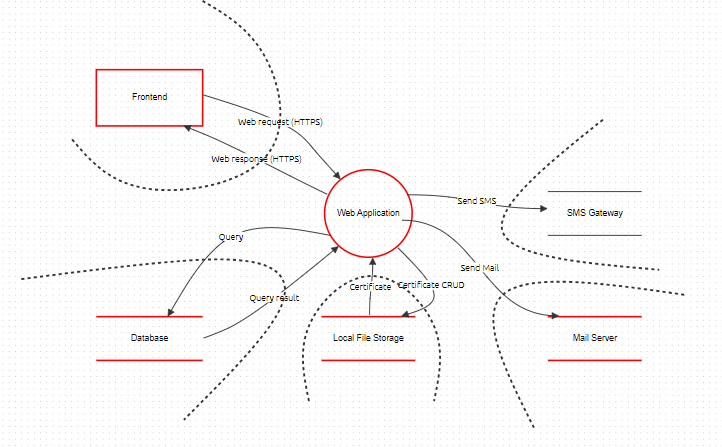
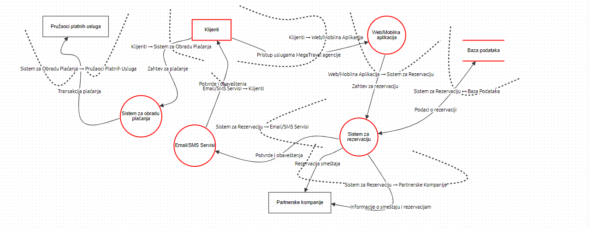

# Model pretnji za projekat iz predmeta informaciona bezbednost

# Zadatak 1 
### Ispitajte ko bi želeo da napadne MegaTravel i zašto. Odredite koje klase napadača bi oštetile sistem. Šta više, za svaku klasu napadača odredite njihov opšti nivo veštine, njihov inherentan pristup sistemu i njihove krajnje ciljeve. 

### **Finansijski motivisani kriminalci**
#### **Nivo veštine**: nizak/srednji/visok
#### **Pristup sistemu** : spoljašnji
#### **Ciljevi**: pristup finansijskim podacima klijenata

### **Konkurencija na tržištu**
#### **Nivo veštine**: srednji/visok
#### **Pristup sistemu** : spoljašnji+unutrašnji
#### **Ciljevi**: sticanje prednosti na tržištu, u odnosu na konkurenciju

### **Špijuni**
#### **Nivo veštine**: visok
#### **Pristup sistemu** : spoljašnji+unutrašnji
#### **Ciljevi**: prikupljanje podataka u bilo koje svrhe

### **Hakerski aktivisti**
#### **Nivo veštine**: srednji/visok
#### **Pristup sistemu** : spoljašnji
#### **Ciljevi**: upad u sistem i ucenjivanje, pronalazak ranjivosti

### **Unutrašnji akteri**
#### **Nivo veštine**: nizak/srednji/visok
#### **Pristup sistemu** : unutrašnji
#### **Ciljevi**: osveta ili zloupotreba iz nezadovoljstva

# Zadatak 2
### Vođeni motivacijom napadača, poslovnim zahtevima MegaTravel-a i svim zakonima i propisima koji bi mogli da utiču na ovu korporaciju, odredite listu osetljive imovine. Za svako sredstvo ispitajte: 
- #### Koja je njegova inherentna izloženost (exposure) – ko ima pristup imovini; 
- #### Koji su bezbednosni ciljevi sredstva (tj. poverljivost, integritet, dostupnost (CIA)); 
- #### Kakav uticaj (impact) bi oštećenje tih bezbednosnih ciljeva (security goals) imala na korporaciju. 

### **Podaci korisnika**
#### **Ko ima pristup:** admin, zaposleni
#### **CIA ciljevi:** poverljivost, integritet, dostupnost
#### **Uticaj:** kompromitovanje korisničkih podataka, finansijski gubici, gubitak poverenja klijenata, pravne posledice

### **Infrastruktura sistema**
#### **Ko ima pristup:** IT osoblje, sistemski admin
#### **CIA ciljevi:** dostupnost, integritet
#### **Uticaj:** finansijski gubici, gubitak prava poslovanja, nedostupnost usluge klijentima

### **Sistem za rezervaciju**
#### **Ko ima pristup:** korisnici, zaposleni, sistem admini
#### **CIA ciljevi:** poverljivost, integritet, dostupnost
#### **Uticaj:** nedostupnost usluge klijentima, finansijski gubici, gubitak klijenata

### **Poslovna imovina**
#### **Ko ima pristup:** developeri, marketing tim, partneri
#### **CIA ciljevi:** poverljivost, integritet
#### **Uticaj:** gubitak prednosti na tržištu, gubitak udela na tržištu

### **Finansijski podaci**
#### **Ko ima pristup:** računovođe, menadžeri za finansije, bankarske institucije
#### **CIA ciljevi:** poverljivost, integritet
#### **Uticaj:** finansijski gubici, gubitak prava poslovanja

# Zadatak 3
### Ispitajte koji korisnici (ljudski, eksterni sistemi) komuniciraju sa MegaTravel sistemom i odatle mapirajte površinu napada kao skup ulaznih tačaka sa kojih napadači mogu da sprovedu svoje napade.

#### **Krisnik:** klijent
#### **Ulazne tačke:** forma za prijavu, forma za registraciju, forma za support, linkovi za review

#### **Krisnik:** zaposleni
#### **Ulazne tačke:** sistem za upravljanje, email, VPN, remote sistemi

#### **Krisnik:** partneri
#### **Ulazne tačke:** API, B2B web servis, email

#### **Krisnik:** pružaoci platnih usluga
#### **Ulazne tačke:** API, forma za web plaćanje

#### **Krisnik:** monitoring sistemi
#### **Ulazne tačke:** log, monitoring infrastrukture, API

#### **Krisnik:** posmatrači
#### **Ulazne tačke:** sistemi za upravljanje dokumentacijum, izveštaji

# Zadatak 4
### Koristeći sve prikupljene informacije, nacrtajte dijagram toka podataka MegaTravel sistema, uključujući površinu napada, spoljne entitete i osetljivu imovinu. Obratite pažnju na granice poverenja (trust boundaries) koje postoje unutar sistema. Počnite sa kontekstnim dijagramom i odatle razložite sve složene procese dok ne prestanu značajne granice poverenja.

# Zadatak 5
### Koristeći nacrtane dijagrame toka podataka i STRIDE metodologiju identifikacije pretnji, identifikujte i dekomponujte pretnje. Za svaku pretnju definišite ublažavanja (mitigations) koja sprečavaju pojavu pretnje.

# Model pretnji za Mega Travel sistem
