# OWASP Juice Shop

## Kako OWASP Juice Shop nudi platformu za izvođenje napada, ali ne govori mnogo o potencijalnim zaštitama, studenti moraju zabeležiti i prodiskutovati sledeće za svaku klasu napada:

- Objasniti klasu napada;
- Koji uticaj iskorištenje (exploit) određene klase ranjivosti može imati;
- Koje ranjivosti u softveru su dozvolile da napad uspe;
- Koje su primerene kontramere (što više detalja, to bolje) kako bi se sprečio napad.

| Naziv klase napada                     | Objašnjenje                                                                                                                                                                                                                       | Uticaj ovog napada                                                                                                                                                                                     | Ranjivosti koje su uzrok                                                                                                                                                                                                                                                                                                                                                                    | Kontramere                                                                                                                                                                                                                                                                            |
| -------------------------------------- | --------------------------------------------------------------------------------------------------------------------------------------------------------------------------------------------------------------------------------- | ------------------------------------------------------------------------------------------------------------------------------------------------------------------------------------------------------ | ------------------------------------------------------------------------------------------------------------------------------------------------------------------------------------------------------------------------------------------------------------------------------------------------------------------------------------------------------------------------------------------- | ------------------------------------------------------------------------------------------------------------------------------------------------------------------------------------------------------------------------------------------------------------------------------------- |
| **XSS** (Cross-Site Scripting)         | Ubacivanje zlonamernih skripti u sadržaj koji se šalje drugim korisnicima                                                                                                                                                         | Krađa cookie-a, phishing, preuzimanje kontrole nad korisničkim nalogom, širenja malvera                                                                                                                | Loša validacija ulaza i izlaza, nedovoljno striktna Content Security Policy (CSP) pravila, zastarela ili ranjiva JavaScript biblioteka                                                                                                                                                                                                                                                      | Adekvatan escaping dinamičkih sadržaja, primena CRS pravila, validacija i sanitacija svih ulaznih podataka, korišćenje modernih framework-a, redovno ažuriranje JavaScript biblioteka, primena dobrih praksi za kod                                                                   |
| **Sensitive Data Exposure**            | Neadekvatna zaštita poverljivih podataka korisnika                                                                                                                                                                                | Finansijska šteta, gubitak privatnosti, krađa identiteta, pravne posledice                                                                                                                             | Prenos osetljivih informacija preko nešifrovanih kanala, slaba enkripcija ili kompromitovan algoritam enkripcije, skladištenje plain text podataka na disk, neadekvatno upravljanje ključevima enkripcije i lozinkama                                                                                                                                                                       | HTTPS, jaka enkripcija, upravljanje ključevima, tokenizacija i pseudonimizacija, minimizacija podataka, politike pristupa, svestranost u bezbednosti, audit i monitoring                                                                                                              |
| **Improper Input Validation**          | Nedostatak ili neadekvatnu proveru podataka koje korisnik unosi u aplikaciju                                                                                                                                                      | Manipulacija aplikacijom na neproverene načine, pristup osetljivim podacima, preuzimanje kontrole nad sistemom, izmena podataka, DoS napadi                                                            | Nedostatak provere formata, tipa i veličine ulaznih podataka, validacija samo na klijentskoj strani, loše enkodiranje ili escape unosa pre obrade ili prikaza, blacklisting umesto whitelisting-a                                                                                                                                                                                           | Stroga validacija na serverskoj strani, whitelisting, escape i encode, korišćenje sigurnosnih biblioteka, ograničavanje velićine ulaza, parametrizovani upiti, redovno ažuriranje i obuka                                                                                             |
| **Broken Access Control**              | Nedostaci u politikama i implementaciji kontrole pristupa                                                                                                                                                                         | Neautorizovani pristup osetljivim informacijama, modifikacija i brisanje podataka, zloupotreba funkcionalnosti sistema                                                                                 | Loša provera privilegija prilikom pristupa resursima, manipulisanje resursima i zahtevima korišćenjem predvidljivih ID-jeva, nedostatak horizontalne i vertikalne kontrole pristupa, ponovna upotreba tokena nakon odjave                                                                                                                                                                   | Primena principa najmanjih privilegija, dinamička kontrola pristupa, snažne autentifikacija i autorizacija, provera pristupa na serverskoj strani, automatsko testiranje i revizija, framework za kontrolu pristupa, zaštita ID-jeva, osiguranje snažne politike upravljanja sesijama |
| **Unvalidated Redirects and Forwards** | Web aplikacija prima zahtev za preusmeravanje na drugu stranicu, ali ne proverava da li je URL koji se koristi za preusmeravanje legitimni i bezbedan                                                                             | Phishing, krađa osetljivih informacija, širenje malvera                                                                                                                                                | Loša provera URL-a koji se koristi za preusmeravanje, dozvoljavanje korisnicima da prosleđuju proizvoljne putanje ili URL-ove kroz query parametre bez validacije                                                                                                                                                                                                                           | Izbegavanje redirekcije kada god je to moguće, stroga validacija URL-ova, korišćenje internih identifikatora, upozorenja za korisnike, provera referera                                                                                                                               |
| **Vulnerable Components**              | Softverske biblioteke, framework, moduli i zavisnosti koje sistem koristi, a koji sadrže poznate ranjivosti                                                                                                                       | Izvršavanje proizvoljnog koda, pristup osetljivim informacijama, DoS napadi, kontrola nad sistemom                                                                                                     | Zastarele ili neažurirane biblioteke, loš uvid u stanje komponenti sistema, retka ažuriranja i provere zavisnosti                                                                                                                                                                                                                                                                           | Redovna evidencija o svim zavisnostima, redovno ažuriranje, alati za upravljanje zavisnostima, minimalizacija zavisnosti, bezbednosni pregledi, izolacija komponenti                                                                                                                  |
| **Broken Authentication**              | Ranjivosti u procesima autentikacije i upravljanju sesijama                                                                                                                                                                       | Neovlašćeni pristup korisničkim nalozima, osetljivim podacima, krađa identiteta                                                                                                                        | Slabe lozinke, Nedostatak MFA ili loša implementacija, loše upravljanje sesijama, ranjivosti u procesima za oporavak lozinki, laka sigurnosna pitanja, predvidljivi identifikatori sesija koji se mogu lako pogoditi ili presresti                                                                                                                                                          | Obavezne jake lozinke, Dobra implementacija MFA, sigurno upravljanje sesijama, bezbedni procesi oporavka naloga, ograničavanje pokušaja za prijavu i reset lozinke, edukacija korisnika                                                                                               |
| **Security through Obscurity**         | Detalji implementacije sistema, algoritmi, ključevi, ili drugi aspekti sigurnosnih mehanizama čuvaju se u tajnosti, pod uverenjem ako napadač ne zna kako sistem funkcijoniše, neće ni moći da mu naškodi                         | Poništavanje svake vrste zaštite kada napadač otkrije algoritam                                                                                                                                        | Slabe i nerobusne mere zaštite, ako se otkriju detalji, ceo sistem je kompromitovan, otežano ispravljanje ranjivosti                                                                                                                                                                                                                                                                        | Princip otvorenog dizajna, redovno testiranje i revizija, primena slojevite sigurnosti, edukacija i svest o sigurnosti                                                                                                                                                                |
| **Insecure Deserialization**           | Neovlašćeni ili zlonamerni korisnici manipulišu serijalizovanim objektima, koji se zatim deserializuju od strane aplikacije                                                                                                       | Kompromitovanje servera, aplikacija, i podataka, izvršavanje proizvoljnog koda na serveru, kršenje privilegija, DoS napadi, krađa podataka, malver                                                     | Prihvatanje serijalizovanih objekata od neovlašćenih ili nepouzdanih izvora, loša provera autentičnosti ili integriteta serijalizovanih podataka pre deserializacije, upotreba nesigurnih ili zastarelih funkcija za deserializaciju                                                                                                                                                        | Izbegavanje deserializacije nepouzdanih podataka, validacija, whitelisting, minimalne privilegije, upotreba sigurnih biblioteka, ažuriranje i pečovanje, edukacija                                                                                                                    |
| **Miscellaneous**                      | Nove ili manje poznate ranjivosti, specifične konfiguracione greške, zanemarene sigurnosne prakse, i drugi rizici za informacione sisteme i mreže                                                                                 | Neautorizovani pristup, gubitak podataka, Dos napad, kompromitovanje sistema                                                                                                                           | Konfiguracione greške i nesigurna podrazumevana podešavanja, nezakrpljene ili zanemarene komponente sistema, zaobilaženje autentifikacije ili autorizacije, slabost u prilagođenom kodu ili logici aplikacije, zanemarene sigurnosne prakse i loše implementirane sigurnosne politike                                                                                                       | Sigurnosne revizije, patch management, testiranje bezbednosti, princip najmanjih privilegija, edukacija, slojevita odbrana                                                                                                                                                            |
| **Broken Anti Automation**             | Nedostatak ili slabosti u mehanizmima sprečavanja ili ograničavanja automatizovanih akcija, kao što su skriptovani napadi, web scraping, automatsko popunjavanje formi, masovno kreiranje naloga, i brute-force napadi na lozinke | Preopterećenja sistema, kompromitacija korisničkih naloga, pristup privatnim podacima, i degradacija korisničkog iskustva                                                                              | Nedostatak ili slabosti u implementaciji CAPTCHA mehanizama, nedostatak ili slaba primena mehanizama za detekciju anomalija u korisničkom ponašanju, oslanjanje na jednostavne ili lako zaobiđene metode za otkrivanje automatizovanih akcija                                                                                                                                               | Primena CAPTCHA, ograničenje brzine zahteva, detekcija i blokiranje automatizovanih akcija, MFA, napredna analitika                                                                                                                                                                   |
| **Injection**                          | Napadač ubacuje ili „injektuje“ zlonameran kod u upite koji se šalju aplikaciji                                                                                                                                                   | Neautorizovani pristup, modifikaciju podataka, kompromitovanje baze podataka, izvršavanje proizvoljnog koda na serveru, preuzimanje kontrole nad sistemom, prekid rada sistema                         | Neadekvatna validacija ili sanitacija korisničkih unosa, upotreba dinamički sastavljenih upita ili komandi koje uključuju nevalidirane korisničke unose, nedostatak upotrebe parametrizovanih upita ili ORM alata,                                                                                                                                                                          | Validacija ulaza, parametrizovani upiti i ORM alati, escaping specijalnih karaktera, minimalne privilegije, upotreba sigurnih alata i biblioteka                                                                                                                                      |
| **Security Misconfiguration**          | Komponenta nije pravilno konfigurisana za optimalnu zaštitu                                                                                                                                                                       | Neovlašćeni pristup, otkrivanje osetljivih podataka, gubitak integriteta podataka, preuzimanje celog sistema, DoS napadi                                                                               | Održavanje podrazumevanih lozinki i korisničkih naloga, nepotrebne usluge ili funkcionalnosti, nedostatak sigurnosnih zaglavlja ili pogrešno konfigurisana sigurnosna zaglavlja u web aplikacijama, otvoreni portovi koji nisu potrebni za poslovanje aplikacije, zastareli softver i komponente bez najnovijih sigurnosnih patch-eva                                                       | Redovno ažuriranje i patchovanje, minimalna eksponiranost, promena podrazumevanog podešavanja, sigurnosni pregledi, pravilna konfiguracija zaglavlja, princip najmanjih privilegija, sigurnosna obuka                                                                                 |
| **Cryptographic Issues**               | Slabosti ili greške u implementaciji kriptografskih funkcija unutar aplikacije ili sistema                                                                                                                                        | Kompromitacija osetljivih podataka, gubitak poverljivosti, integriteta i dostupnosti informacija, mogućnosti za razne napade, mogućnost presretanja podataka, izmene podataka, napadi na autentikaciju | Korišćenje zastarelih ili slabih kriptografskih algoritama, loše upravljanje kriptografskim ključevima, uključujući nedostatak sigurnog skladištenja, prenos ključeva preko nesigurnih kanala, i nedostatak rotacije ključeva, nedostatak enkripcije za osetljive podatke kako u mirovanju tako i tokom prenosa, neadekvatna implementacija funkcija za proveru integriteta i autentikaciju | Korišćenje jakih i savremenih kritografskih algoritama, efikasno upravljanje ključevima, enkriptovanje osetljivih podataka, primena funkcija za proveru integriteta i autentifikaciju, redovna revizija i testiranje                                                                  |
| **XXE**                                | Aplikacija koja obrađuje XML podatke nepravilno obrađuje reference na spoljne entitete unutar XML dokumenata                                                                                                                      | Pristup fajl sistemima i mrežama, eksfiltracija osetljivih podataka, izvršavanje proizvoljnog koda, izvođenje napada na druge sisteme unutar mreže organizacije                                        | Aplikacije koje koriste starije ili nekonfigurisane XML parsere koji implicitno dozvoljavaju obradu spoljnih XML entiteta, loša validacije i sanitacije unosa XML podataka koje aplikacija prima od korisnika ili iz drugih nepouzdanih izvora, konfiguracija XML parsera koja ne ograničava pristup spoljnim resursima ili funkcijama                                                      | Onemogućavanje obrade spoljnih entiteta, ažuriranje i konfiguracija alata, validacija ulaza, bezbednosni pregledi i testiranja                                                                                                                                                        |

## Anja Petković SV22/2020 zadaci:

### Login Admin

- email: admin@juice-sh.op' or 1=1;--
- password: test
- Takođe se može ulogovati na ovaj nalog korišćenjem brute force tehnike za lozinku. Lozinka za admin@juice-sh.op je veoma jednostavna: admin123.

| Naziv klase napada | Težina napada | Objašnjenje                                                                                                                                     | Uticaj ovog napada                                                                                                                 | Ranjivosti koje su uzrok                                                                             | Kontramere                                             |
| ------------------ | ------------- | ----------------------------------------------------------------------------------------------------------------------------------------------- | ---------------------------------------------------------------------------------------------------------------------------------- | ---------------------------------------------------------------------------------------------------- | ------------------------------------------------------ |
| Injection          | 2             | admin@juice-sh.op' or 1=1;-- email je pronađen iz recenzija, a ' or 1=1;-- je dobijen brutforce metodom sa generalnim tehnikama SQL injection-a | Uticaj ovog napada bi mogao biti krađa naloga i kredencijala, kao i izvršavanje operacija za koje je potrebna uloga administratora | Ranjivost koja dovodi do ovoga je loša sanitizacija polja za unos email-a i lozinke prilikom login-a | Bolja sanitizacija polja i validacija unetih karaktera |

### Forgotten Developer Backup

- Rešenje je posetiti sledeći link: http://localhost:3000/ftp/package.json.bak%2500.md

| Naziv klase napada      | Težina napada | Objašnjenje                                                                                                                                                                                                                                                                                                                                          | Uticaj ovog napada                                                                                                                                                 | Ranjivosti koje su uzrok                                                                                 | Kontramere                                                                                                                                                                                                                         |
| ----------------------- | ------------- | ---------------------------------------------------------------------------------------------------------------------------------------------------------------------------------------------------------------------------------------------------------------------------------------------------------------------------------------------------- | ------------------------------------------------------------------------------------------------------------------------------------------------------------------ | -------------------------------------------------------------------------------------------------------- | ---------------------------------------------------------------------------------------------------------------------------------------------------------------------------------------------------------------------------------- |
| Sensitive Data Exposure | 4             | Rešenje je da prvo pronađemo skriveni ftp folder koji nije dobro sakriven, zatim vidimo da se folder package.json.bak ne može tek tako preuzeti, već su dozvoljeni samo .md i .pdf fajlovi za preuzimanje, nakon toga ćemo na kraj linka za preuzimanje dodati %2500.md i simulirati preuzimanje .md datoteke uz dodavanje position null byte: %2500 | Uticaj ovog napada bi mogao biti preuzimanje dokumenata koja treba da ostanu zaštićena ili pristup podacima koji su poverljivi, kao npr. korišćene biblioteke ovde | Ranjivost koja dovodi do ovoga je loša zaštita podataka i dokumenata, a takođe i loša validacija linkova | Bolja validacija uloge prilikom preuzimanja dokumenta i obavezna upotreba tokena prilikom preuzimanja, bolja validacija i sanitizacija linkova za preuzimanje kako bi se izbeglo preuzimanje korišćenjem position null byte: %2500 |

### Repetitive Registration

POST /api/Users/ HTTP/1.1
Host: localhost:3000

    {"email":"admin3@gmail.com",
    "password":"admin",
    "passwordRepeat":"admin1",
    "securityQuestion":{
        "id":1,
        "question":"Your eldest siblings middle name?",
        "createdAt":"2024-04-09T09:52:16.204Z",
        "updatedAt":"2024-04-09T09:52:16.204Z"},
        "securityAnswer":"Me"
    }

| Naziv klase napada        | Težina napada | Objašnjenje                                                                                                                               | Uticaj ovog napada                                                                              | Ranjivosti koje su uzrok                                               | Kontramere                                                                                                                                                                 |
| ------------------------- | ------------- | ----------------------------------------------------------------------------------------------------------------------------------------- | ----------------------------------------------------------------------------------------------- | ---------------------------------------------------------------------- | -------------------------------------------------------------------------------------------------------------------------------------------------------------------------- |
| Improper Input Validation | 1             | Prethodni POST zahtev se može izvršiti upotrebom Burp-a iako imamo u telu "password":"admin", "passwordRepeat":"admin1" koje su različite | Uticaj ovog napada bi mogao biti zloupotreba i loš unos kredencijala, kao i zbunjivanje sistema | Ranjivost koja dovodi do ovoga je loša validacija na serverskoj strani | Bolja validacija i na klijentskoj i na serverskoj strani za unos lozinke i potvrdu iste, kao i sprečavanje zloupotreba vezanih za slanje zahteva van klijentske aplikacije |

### Login Support Team

- Email support naloga se može pronaći na stranici: http://localhost:3000/#/administration
- Prilikom rešavanja drugih izazova otkiven je poverljivi dokument http://localhost:3000/ftp/incident-support.kdbx i preuzet pomoću posiposition null byte: %2500
- Kako ovaj file ima kdbx ekstenziju pomoću aplikacije KeePass ga učitavamo, a to traži master lozinku
- Do master lozinke se dolazi pretraživanjem main.js i nalaženjem sledećeg teksta: Parola echipei de asistență nu respectă politica corporativă pentru conturile privilegiate! Vă rugăm să schimbați parola în consecință! Kada se ovaj tekst prevede na engleski dobijamo: The password of the support team does not respect the corporate policy for privileged accounts! Please change your password accordingly! RegEx izraz: (?=._[a-z])(?=._[A-Z])(?=._\d)(?=._[@$!%*?&])[A-Za-z\d@$!%*?&]{12,30} Brute force metodom dolazimo do ove lozinke: Support2022!
- Kada dobavimo lozinku i pristup kdbx fajlu, onda možemo da pristupimo lozinki od naloga desnim klikom na taj entry pa na Edit Entry opciju.

| Naziv klase napada        | Težina napada | Objašnjenje                                   | Uticaj ovog napada                                                                                                                                                                         | Ranjivosti koje su uzrok                                                                                                                                               | Kontramere                                                                                                                                                                                         |
| ------------------------- | ------------- | --------------------------------------------- | ------------------------------------------------------------------------------------------------------------------------------------------------------------------------------------------ | ---------------------------------------------------------------------------------------------------------------------------------------------------------------------- | -------------------------------------------------------------------------------------------------------------------------------------------------------------------------------------------------- |
| Security Misconfiguration | 6             | Postupak za rešavanje izazova je opisan iznad | Uticaj ovog napada bi mogao biti preuzimanje kontrole nad nalogom ili izvršavanja naredbi koje nisu dozvoljene u aplikaciji, krađa podataka, finansijski gubici i gubitak prava poslovanja | Ranjivost koja dovodi do ovoga je loša zaštita podataka i dokumenata, a takođe i slabe lozinke za pristup fajlovima i otkrivanje informacija koje su strogo poverljive | Kontramere su razne ali najvažnija je zaštita strogo poverljivih dokumenata od preuzimanja i ažtita istih od neautorizovanog pristupa. Takođe i postavljanje jakih lozinki na sva mesta u sistemu. |

### Kill Chatbot

-Chatbot je kreiran korišćenjem biblioteke

    juicy-chat-bot

-Poruke u ovoj biblioteci se procesuiraju unutar VM konteksta i njegove funkcije

    process

-Komanda evaluira poruke

    this.factory.run(`users.addUser("${token}", "${name}")`)

. Ovo se može iskoristiti uključivanjem " i ) u svoje korisničko ime

-Ako neko postavi svoje korisničko ime na

    admin"); process=null; users.addUser("1337", "test,

izvršio bi se sledeći kod:

    users.addUser("token", "admin");
    process = null;
    users.addUser("1337", "test")

| Naziv klase napada    | Težina napada | Objašnjenje                                   | Uticaj ovog napada                                           | Ranjivosti koje su uzrok                                                                                  | Kontramere                                                                                                                                  |
| --------------------- | ------------- | --------------------------------------------- | ------------------------------------------------------------ | --------------------------------------------------------------------------------------------------------- | ------------------------------------------------------------------------------------------------------------------------------------------- |
| Vulnerable Components | 5             | Postupak za rešavanje izazova je opisan iznad | Uticaj ovog napada je onemogućavanje normalnog rada programa | Ranjivost koja dovodi do ovoga je korišćenje ranjivih biblioteka i izvorni kod koji nema dobre validacije | Kontramere su razne ali najvažnija je korišćenje biblioteka koje su sigurne i proverene ili wrapovanje koda i validacija ulaza u biblioteku |

### Forged Feedback

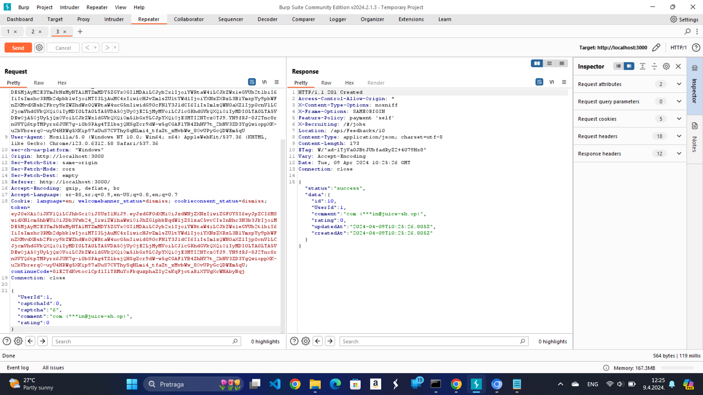

- Korišćenjem Burp Suite-a ispratimo pravi zahtev i u Repeater-u ponovimo isti sa drugim UserId
  | Naziv klase napada | Težina napada | Objašnjenje | Uticaj ovog napada | Ranjivosti koje su uzrok | Kontramere |
  |--- |--- |--- |--- |--- |--- |
  | Broken Access Control | 3 | Postupak za rešavanje izazova je opisan iznad na slici | Uticaj ovog napada bi mogao biti preuzimanje kontrole nad nalogom ili izvršavanja naredbi koje nisu dozvoljene u aplikaciji, krađa podataka | Ranjivost koja dovodi do ovoga je loša provera ulaznih podataka i verifikacija tokena i user-a koji izvršava naredbe | Kontramere su razne ali najvažnija je provera podataka i verifikacija korisnika koji vrši akciju i tokena |

## Branislav Stojković SV64/2020 zadaci:

### CAPTCHA Bypass

- Kao ulogovan korisnik udjemo u odeljak za feedback i šalje validan feedback. Zatim, koristeći Burp Suite, pratimo istoriju poslatih zahteva i pronađemo dati POST zahtev.

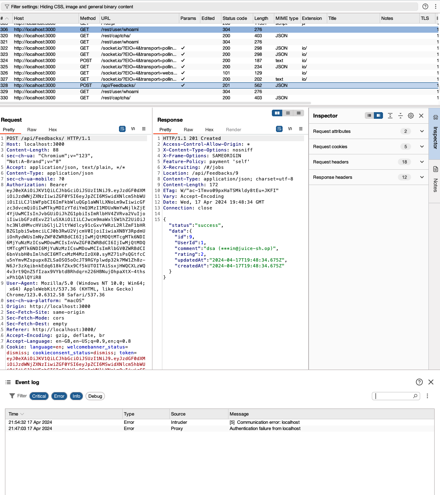

- Koristeci funkciju Repeater za ponavljanje POST zahteva sa istim CAPTCHA kodom. Ispituje se mogućnost da sistem dozvoljava višestruko slanje istog CAPTCHA koda, što omogućava slanje višestrukih zahteva u kratkom vremenskom periodu.

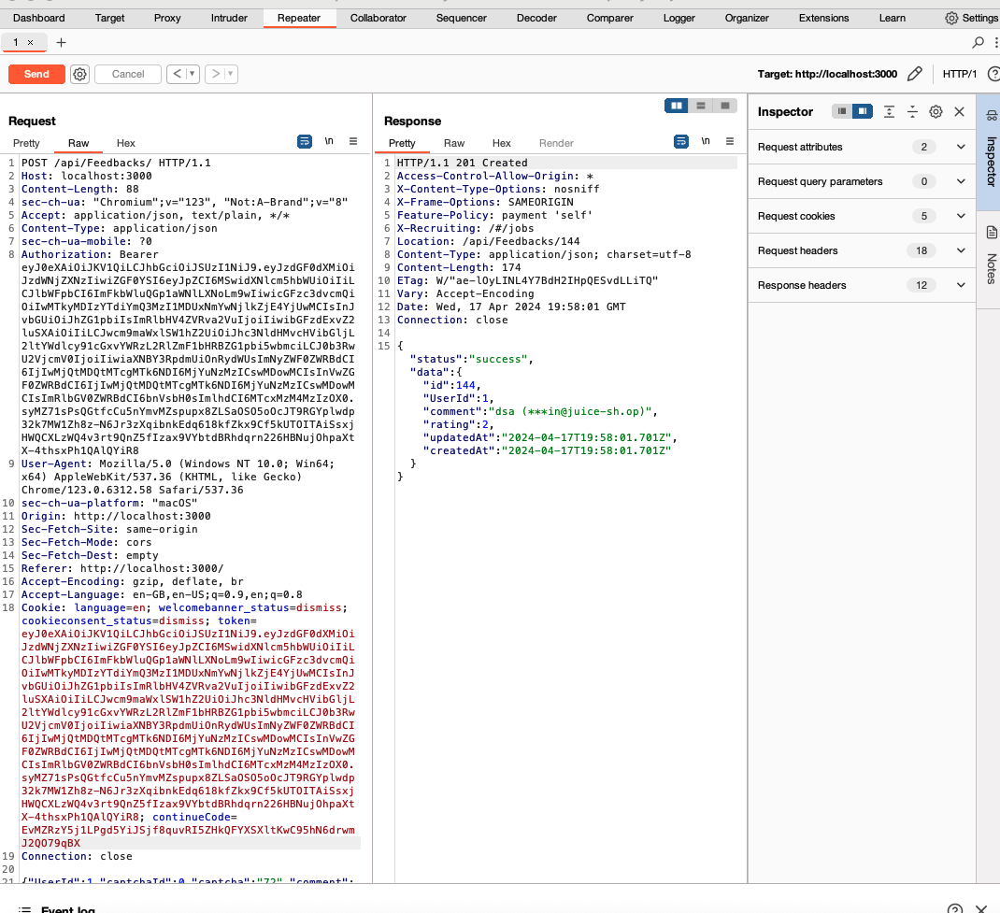

- Napomena: U praksi se za višestruko slanje zahteva koristi Intruder ali je to podržano samo u Burp Suite premium.

| Naziv klase napada      | Težina napada | Objašnjenje                                                                                                                                                              | Uticaj ovog napada                                                                                                                               | Ranjivosti koje su uzrok                                                             | Kontramere                                                                                                    |
| ----------------------- | ------------- | ------------------------------------------------------------------------------------------------------------------------------------------------------------------------ | ------------------------------------------------------------------------------------------------------------------------------------------------ | ------------------------------------------------------------------------------------ | ------------------------------------------------------------------------------------------------------------- |
| Denial of Service (DoS) | 4             | Ulogovani korisnik šalje validan feedback, a zatim se koristi Burp Suite za ponavljanje POST zahteva sa istim CAPTCHA kodom, proveravajući mogućnost višestrukog slanja. | Ovakav napad može dovesti do preopterećenja sistema, što bi moglo uzrokovati usporavanje ili potpuni prekid rada aplikacije za ostale korisnike. | Neinvalidiranje CAPTCHA koda nakon upotrebe i nedostatak ograničenja brzine zahteva. | Implementacija invalidacije CAPTCHA kodova nakon upotrebe i ograničenja brzine zahteva za osetljive funkcije. |

### Password Strength

- U odeljku sa recenzijama artikala pronađen je admin e-mail. Koristeći taj e-mail, pokušavamo da se prijavimo sa generičkim lozinkama. Nakon što se u Burp Suite-u uoči POST zahtev koji se koristi za prijavu, koristi se funkcija Intruder za automatizovanje slanja velikog broja zahteva za prijavu.

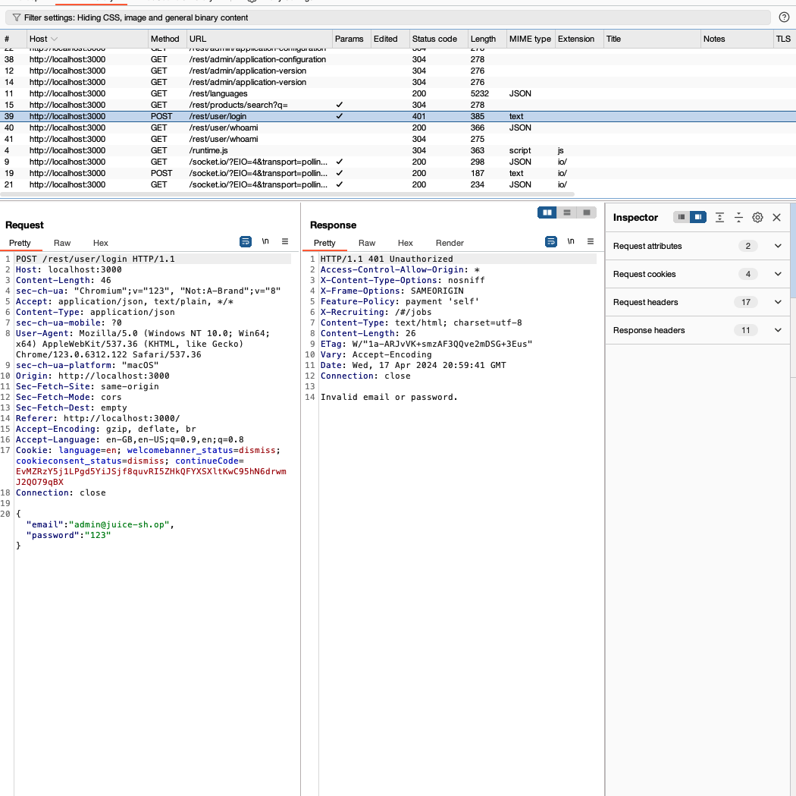

- U Intruder se učitava tekstualna datoteka sa listom lozinki preuzetom sa GitHub-a, specifično sa adrese https://github.com/fuzzdb-project/fuzzdb/blob/master/wordlists-user-passwd/passwds/john.txt. Podešavanjem Intrudera, vrši se slanje zahteva sa različitim lozinkama iz liste.

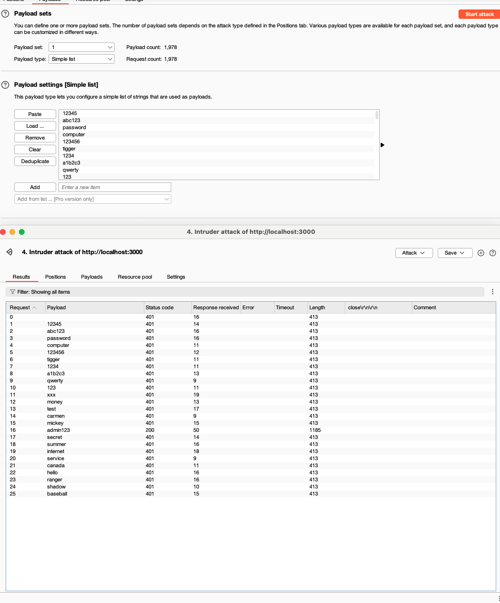

| Naziv klase napada    | Težina napada | Objašnjenje                                                                                                                                                | Uticaj ovog napada                                                                                                | Ranjivosti koje su uzrok                                              | Kontramere                                                                                    |
| --------------------- | ------------- | ---------------------------------------------------------------------------------------------------------------------------------------------------------- | ----------------------------------------------------------------------------------------------------------------- | --------------------------------------------------------------------- | --------------------------------------------------------------------------------------------- |
| Broken Authentication | 3             | Pronalazak administratorskog e-maila u recenzijama artikala omogućava pokušaj prijave sa listom čestih lozinki koristeći funkciju Intruder u Burp Suite-u. | Uspešan napad omogućava neovlašćeni pristup administratorskom nalogu, što može dovesti do kompromitacije sistema. | Slaba jačina lozinki i nedostatak ograničenja pri pokušajima prijave. | Uvođenje politike jakih lozinki i implementacija mehanizama za sprečavanje bruteforce napada. |

### Web3 Sandbox

- Proučavanjem izvornog koda web stranice putem alata za inspekciju, uočavamo zanimljiv detalj unutar main.js datoteke. U ovom JavaScript fajlu otkrivamo putanju koja vodi do tajne stranice na kojoj se nalazi smart contract. Ova stranica, skrivena od običnog korisničkog pristupa, pruža uvid u detalje i funkcionalnosti smart contracta koji su ključni za razumevanje i eventualnu manipulaciju unutar Web3 aplikacije.

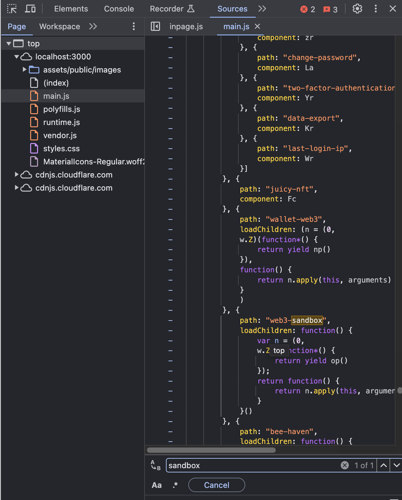
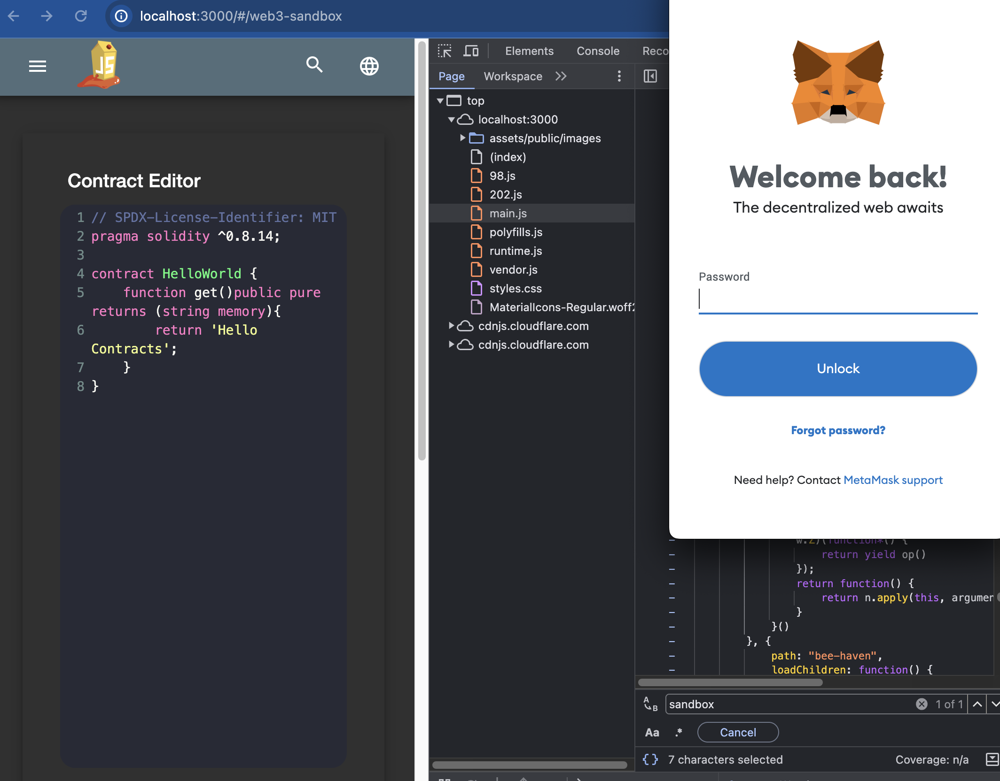

| Naziv klase napada  | Težina napada | Objašnjenje                                                                                                                                                                                                    | Uticaj ovog napada                                                                                                                                                         | Ranjivosti koje su uzrok                                                             | Kontramere                                                                                                                           |
| ------------------- | ------------- | -------------------------------------------------------------------------------------------------------------------------------------------------------------------------------------------------------------- | -------------------------------------------------------------------------------------------------------------------------------------------------------------------------- | ------------------------------------------------------------------------------------ | ------------------------------------------------------------------------------------------------------------------------------------ |
| Unauthorized Access | 4             | Proučavanjem izvornog JavaScript koda (main.js) otkrivena je skrivena putanja do stranice sa detaljima o smart contractu. Stranica je inače nedostupna za obične korisnike, ali je dostupna kroz direktan URL. | Pristup ovoj stranici omogućava uvid u ključne informacije i funkcionalnosti smart contracta, što može voditi ka manipulaciji ili narušavanju integriteta Web3 aplikacije. | Slabosti u upravljanju pristupom i neadekvatna zaštita važnih stranica u aplikaciji. | Implementacija strogih pravila za upravljanje pristupom, enkripcija tajnih putanja, i regularne sigurnosne revizije stranica i koda. |

### Bonus Payload

- U okviru Bonus Payload izazova, koristi se payload koji uključuje iframe od SoundCloud-a za automatsko puštanje audio zapisa. Ovaj iframe se ubacuje direktno u HTML strukturu stranice preko korisničkog unosa koji nije adekvatno sanitizovan. Kada korisnik poseti stranicu koja dinamički renderuje sadržaj baziran na korisničkom unosu, iframe se izvršava, čime se pokreće audio sadržaj. Ovo pokazuje kako se skripti sa drugih domena može omogućiti izvršenje unutar domena aplikacije, što predstavlja osnovni princip XSS napada.

| Naziv klase napada         | Težina napada | Objašnjenje                                                                                                                                                                       | Uticaj ovog napada                                                                              | Ranjivosti koje su uzrok                                                              | Kontramere                                                                                                                     |
| -------------------------- | ------------- | --------------------------------------------------------------------------------------------------------------------------------------------------------------------------------- | ----------------------------------------------------------------------------------------------- | ------------------------------------------------------------------------------------- | ------------------------------------------------------------------------------------------------------------------------------ |
| Cross-Site Scripting (XSS) | 3             | Koristi se `<iframe>` SoundCloud-a kao payload u DOM XSS izazovu, gde korisnički unos nije dovoljno sanitizovan. Ovaj iframe se automatski izvršava kada korisnik učita stranicu. | Izvršavanje iframe-a može omogućiti neautorizovani pristup ili manipulaciju podacima korisnika. | Neadekvatna sanitizacija korisničkog unosa koji omogućava ubacivanje štetnih skripti. | Implementacija adekvatne sanitizacije korisničkog unosa, koristeći sigurnosne prakse kao što su Content Security Policy (CSP). |

### Empty User Registration

- Prilikom registracije novog korisnika, koristi se formular na web stranici koji zahteva unos email adrese i lozinke. Međutim, kada se ovaj zahtev za registraciju pošalje, koristi se Burp Suite za presretanje POST zahteva. U presretnutom zahtevu, korisničko ime i lozinka se mogu promeniti tako da postanu prazni stringovi pre nego što se zahtev prosledi serveru. Ako aplikacija omogući registraciju sa praznim poljima, to ukazuje na nedostatke u validaciji forme i sigurnosne provjere na strani servera. Ovo može dovesti do stvaranja neautorizovanih ili nevalidnih korisničkih naloga.

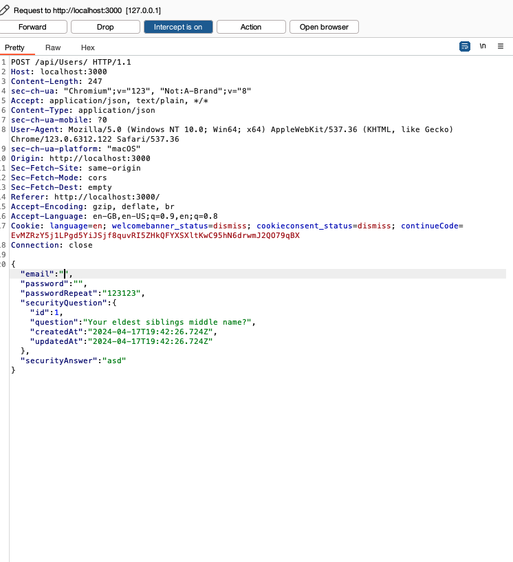

| Naziv klase napada        | Težina napada | Objašnjenje                                                                                                        | Uticaj ovog napada                                                                         | Ranjivosti koje su uzrok                                                    | Kontramere                                                                                                          |
| ------------------------- | ------------- | ------------------------------------------------------------------------------------------------------------------ | ------------------------------------------------------------------------------------------ | --------------------------------------------------------------------------- | ------------------------------------------------------------------------------------------------------------------- |
| Improper Input Validation | 3             | Proces registracije dozvoljava promenu unetih podataka za email i lozinku u prazne stringove koristeći Burp Suite. | Registracija korisnika sa praznim emailom i lozinkom može dovesti do sigurnosnih problema. | Nedostatak adekvatne validacije polja za email i lozinku na strani servera. | Implementacija robustne validacije forme na klijentskoj i server-side strani, uključujući provjere obaveznih polja. |

### Login Jim

Koristeći e-mail adresu "jim@juice-sh.op" koja je dobijena iz recenzije proizvoda, napad se izvodi tako što se u formular za prijavu na web stranicu unese ova e-mail adresa uz dodatak SQL komentara (`'--`). Tačnije, koristi se "jim@juice-sh.op'--" u polju za e-mail i bilo koji tekst u polju za lozinku. Ova kombinacija dovodi do toga da se ostatak SQL upita, koji bi trebalo da proverava lozinku, komentariše, omogućavajući pristup bez potrebe za validnom lozinkom. Ovakav pristup ukazuje na to da aplikacija ne sanitizuje korisnički unos, što omogućava izvršavanje proizvoljnog SQL koda.

| Naziv klase napada | Težina napada | Objašnjenje                                                                                                                                                              | Uticaj ovog napada                                                                    | Ranjivosti koje su uzrok                                                   | Kontramere                                                                                                                                |
| ------------------ | ------------- | ------------------------------------------------------------------------------------------------------------------------------------------------------------------------ | ------------------------------------------------------------------------------------- | -------------------------------------------------------------------------- | ----------------------------------------------------------------------------------------------------------------------------------------- |
| SQL Injection      | 5             | E-mail adresa korisnika "jim@juice-sh.op" koristi se za izvršavanje SQL Injection napada dodavanjem SQL komentara (`'--`) u login formu. Ovo neutrališe proveru lozinke. | Napad omogućava neautorizovani pristup Jimovom nalogu bez potrebe za tačnom lozinkom. | Neadekvatna sanitacija unosa koji omogućava injektovanje štetnog SQL koda. | Implementacija parametrizovanih upita, upotreba ORM alata koji automatski sanitizuju unos, i redovna sigurnosna edukacija razvojnog tima. |

### Easter egg

- Nakon pronadjenog skrivenog foldera na putanji localhost:3000/ftp, pronadjen je "easter egg" fajl.

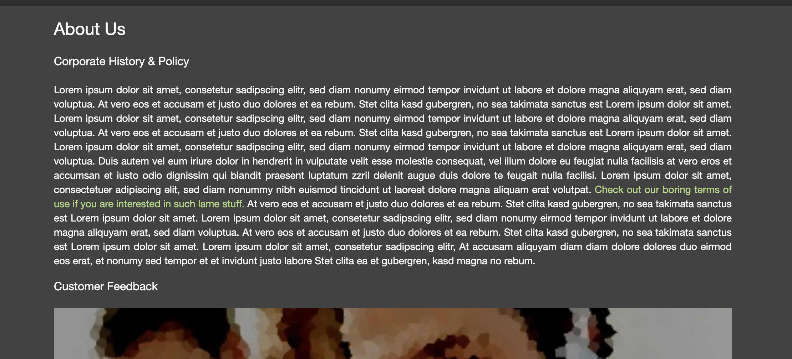

Pošto je zahtevano da se pristupi .md fajlu, dodato je enkodiranje za .md (%2500.md) u URL.

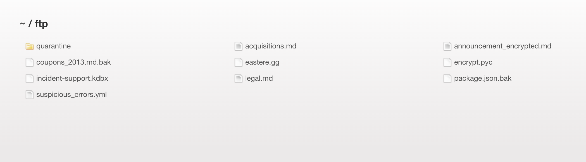

Fajl koji je preuzet sadržao je tekst enkriptovan u Base64 formatu.

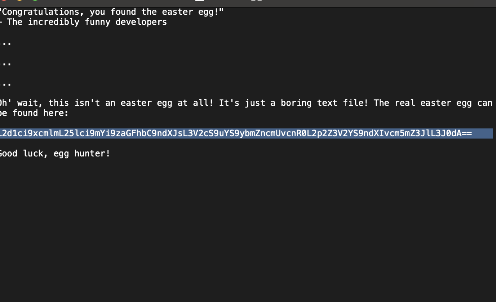

Prvi korak u dešifrovanju bio je dekodiranje Base64 enkripcije, čime je dobijen običan tekst koji nije imao smisla. Nakon toga, primenjena je ROT13 šifra na dekodirani tekst, što je omogućilo čitanje originalnih, skrivenih poruka.
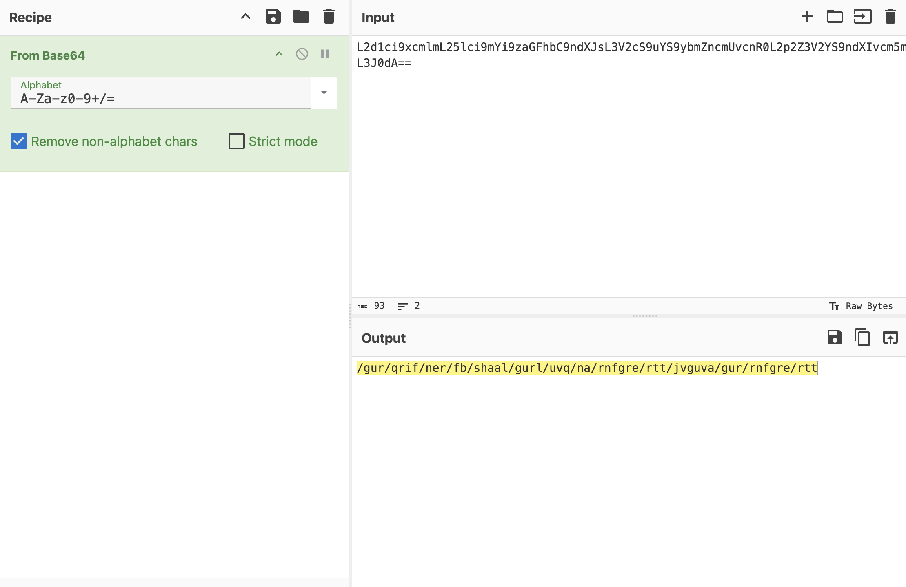

## Veljko Bubnjević SV51-2020 zadaci:

### **View Basket**

Cilj je da vidimo potrošačku korpu drugog korisnika.

Slanjem HTTP zahteva sa identifikatorom korpe drugog korisnika možemo pristupiti njegovoj korpi.

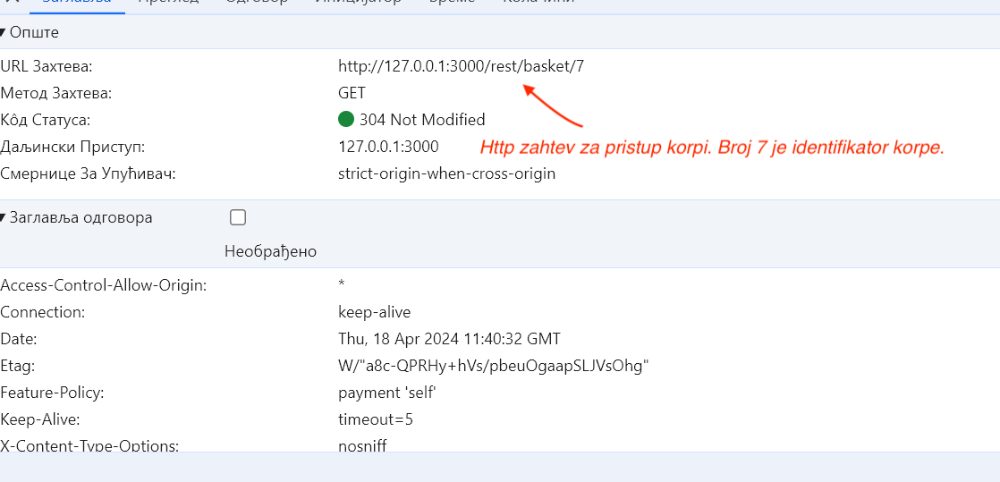

|  Naziv klase napada   | Težina napada |                                                                                                                                                                  Objašnjenje                                                                                                                                                                   |                                             Uticaj ovog napada                                             |                      Ranjivosti koje su uzrok                       |                                  Kontramere                                   |
| :-------------------: | :-----------: | :--------------------------------------------------------------------------------------------------------------------------------------------------------------------------------------------------------------------------------------------------------------------------------------------------------------------------------------------: | :--------------------------------------------------------------------------------------------------------: | :-----------------------------------------------------------------: | :---------------------------------------------------------------------------: |
| Broken Access Control |       2       | Ulogovali smo se kao 2 korisnika. Za oba korisnika su dodati artikli u korpu. Kada smo pristupili korpi prvog korisnika možemo videti iz konzole da je poslat HTTP GET zahtev za pristup korpi, pri čemu se vidi koji je identifikator korpe. Slanjem HTTP zahteva sa identifikatorom korpe drugog korisnika možemo pristupiti njegovoj korpi. | Napadač može da špijunira žrtve tokom kupovine, pri čemu može manipulisati artiklima i njihovom količinom. | Prilikom slanja GET zahteva za pristup korpi ne proverava se Token. | Proveravanje tokena prilikom slanja GET zahteva za pristup korisničkoj korpi. |

### **Login Bender**

Cilj je da se ulogujemo kao mušterija Bender koristeći _Injection_ napad.

Za prijavu koristi se "bender@juice-sh.op'--" u polju za e-mail i bilo koji tekst u polju za lozinku. Kako u SQL znak -- označava komentar koji nadoilazi, ostatak SQL koda koji bi proveravao lozinku bi se zakomentarisao.

| Naziv klase napada | Težina napada |                                                                           Objašnjenje                                                                           |                            Uticaj ovog napada                             |                                                    Ranjivosti koje su uzrok                                                     |                                            Kontramere                                            |
| :----------------: | :-----------: | :-------------------------------------------------------------------------------------------------------------------------------------------------------------: | :-----------------------------------------------------------------------: | :-----------------------------------------------------------------------------------------------------------------------------: | :----------------------------------------------------------------------------------------------: |
|     Injection      |       3       | Izvršava se logovanje korisnika bez provere lozinke jer se na kraju maila (username) dodaju specijalni karakteri '--" koji vrše zakomentarisanje ostatka koda.  | Napadač može da se uloguje kao Bender bez potrebe da zna njegovu lozinku. | Ranjivost u ovom slučaju je nedostatak pravilne obrade korisničkog unosa prilikom formiranja SQL upita u aplikaciji za prijavu. | Korišćenje parametrizovanih upita umesto konkatenacije stringova, korišćenje firewall-a i drugo. |

## **Admin Registration**

Cilj napada je registracija običnog korisnika pri čemu će imati pristup adminovim privilegijama.

Prilikom registracije novog korisnika možemo da uočimo atribut _role_ koji se šalje pri zahtevu, pri čemu je automatski postavljen na _customer_. Izmenom vrednosti atributa sa _customer_ na _admin_ možemo dobiti iste privilegije kao admininistrator.

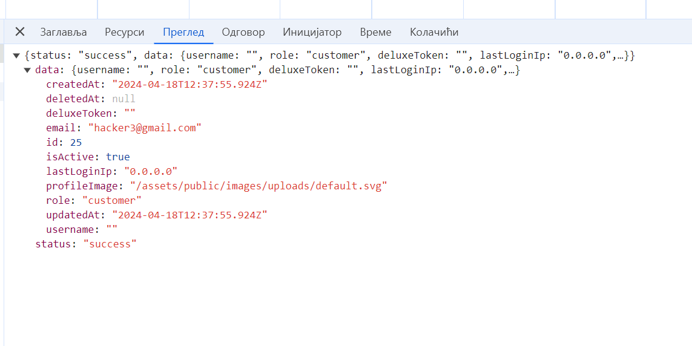
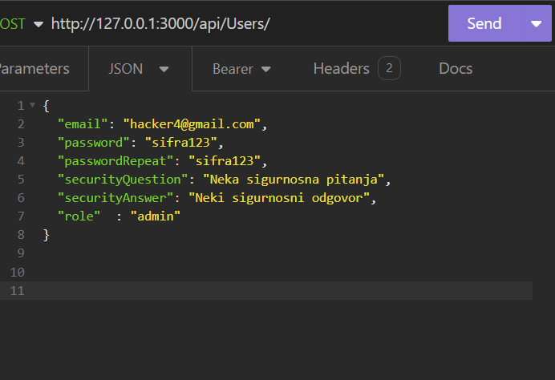

|           Naziv klase napada            | Težina napada |                                                                           Objašnjenje                                                                           |                         Uticaj ovog napada                         |                       Ranjivosti koje su uzrok                        |                                              Kontramere                                              |
| :-------------------------------------: | :-----------: | :-------------------------------------------------------------------------------------------------------------------------------------------------------------: | :----------------------------------------------------------------: | :-------------------------------------------------------------------: | :--------------------------------------------------------------------------------------------------: |
| 
Improper Input Validation

 |       3       | Dodavanjem atributa _role_ i postavljanjem vrednosti na _admin_ pri slanju zahteva za registraciju može novo registrovani korisnik dobiti adminove privilegije. | Napadač može da dobije adminove privilegije prilikom registracije. |  Nedovoljna validacija korisničkog unosa, nedostatak autorizacije. | Implementacija sigurnosnih principa najmanjih privilegija, provera ovlašćenja prilikom svake akcije. |

## **Privacy Policy Inspection**

Treba dokazati da je pročitan Privacy and Policy. U opisu izazova je navedeno da se obrati pažnja na sve ‘hot’ delove teksta, tj. one kada mišem pređemo preko njih oni promene boju. Čitanjem teksta dobijamo niz sledećih reči koji su se osvetle kada se uradi hover sa mišem:
_[http://localhost:3000, We, may, also, instruct, your, browser, to, refuse, all, reasonably, necessary, responsibility]._
Zatim konkatenacijom ovih stringova dobijamo URL adresu:
<http://localhost:3000/we/may/also/instruct/you/to/refuse/all/reasonably/necessary/responsibility>

Prikaz je sledeći:

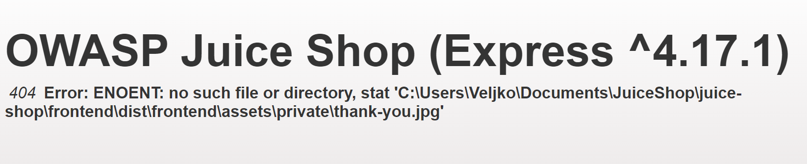

|     Naziv klase napada     | Težina napada |                                               Objašnjenje                                               |                                                         Uticaj ovog napada                                                         |                               Ranjivosti koje su uzrok                                |                                            Kontramere                                            |
| :------------------------: | :-----------: | :-----------------------------------------------------------------------------------------------------: | :--------------------------------------------------------------------------------------------------------------------------------: | :-----------------------------------------------------------------------------------: | :----------------------------------------------------------------------------------------------: |
| Security through Obscurity |       3       | Dokaz o pročitanosti politike privatnosti pronalaženjem skrivenih reči i mapiranjem njih na URL adresu. | Korisnici mogu biti izloženi riziku povrede privatnosti, jer se njihovi lični podaci mogu neovlašćeno koristiti ili distribuirati. | Omogućeno je napadaču da manipuliše URL-om kako bi otkrio skrivene delove aplikacije. | Izbegavati korišćenje URL zahteva koji mogu da se dobiju iz samog teksta politike i privatnosti. |

### **Client-side XSS Protection**

Cilj je izvrsavanje XSS napada sa <iframe src="javascript:alert('xss')"\>
zaobilazeći sigurnosni mehanizam na strani klijenta. Kako je sam zahtev za novu registraciju klijenta ranjiv, presretanjem zahteva i slanem emaila koji je <iframe src="javascript:alert('xss')"\>
možemo da izazovemo XSS napad kada administrator pristupi stranici administracije.

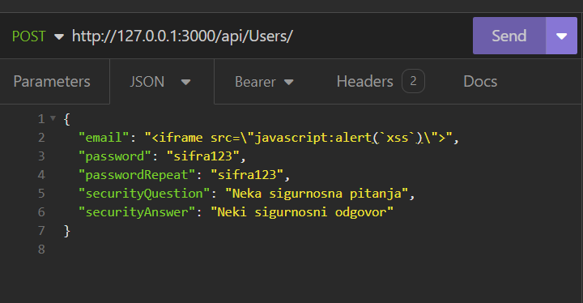
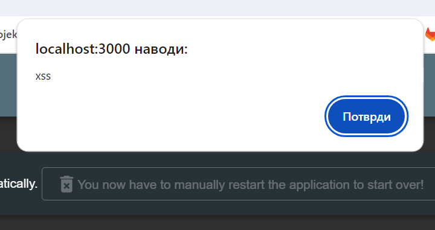

| Naziv klase napada | Težina napada |                                                         Objašnjenje                                                         |                     Uticaj ovog napada                      |                                       Ranjivosti koje su uzrok                                        |                                                       Kontramere                                                       |
| :----------------: | :-----------: | :-------------------------------------------------------------------------------------------------------------------------: | :---------------------------------------------------------: | :---------------------------------------------------------------------------------------------------: | :--------------------------------------------------------------------------------------------------------------------: |
|        XSS         |       3       | Izvršavanje XSS napade presretanjem zahteva za registraciju i slanje _iframe_ kao email, koji se pojavljuje administratoru. | Mogućnost krađe kolačića administratora od strane napadača. | Mogućnost zaobilaženja provere unosa na klijentskoj strani aplikacije bez dodatne provere na serveru. | Enkodiranje HTML koda, korišćenje XSS zaštite na strani klijenta, provera valjanosti na klijentu se vrši i na serveru. |
